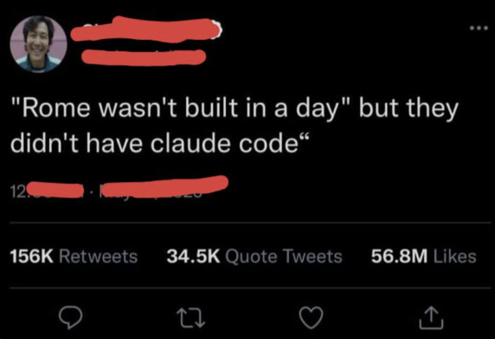

# Why Claude Code?

## What makes Claude Code different

You've probably used ChatGPT, Gemini, or Claude in a chat window. You type a question, get an answer. That's useful — but it's limited. You're the one doing all the work: copying, pasting, switching between apps, applying changes manually.

**Claude Code is different.** It doesn't just answer questions — it actually does things on your computer:

- **Reads your files** — it sees your entire project, not just what you paste
- **Makes changes** — it edits files, creates new ones, reorganizes content
- **Runs commands** — it can search, analyze data, and execute tasks
- **Works autonomously** — you describe what you want, Claude figures out how

Think of it this way: regular AI chat is like texting a smart friend for advice. Claude Code is like having that friend sit down at your computer and do the work with you.

---

> **Don't let the name fool you.** It's called "Claude Code," but you don't need to write a single line of code to use it. What you actually have is a full AI agent with access to your computer — it reads documents, browses the web, controls apps, and executes multi-step tasks autonomously. Market research, competitive analysis, data cleanup, content pipelines, report generation — all of that is Claude Code territory. The "Code" in the name refers to how it works under the hood, not what you need to know.

---

## The different ways to use Claude Code

Claude Code is available in several places:

| Option | Best for | Limitations |
|--------|----------|-------------|
| **Terminal (CLI)** | Full power, no restrictions | Requires basic terminal knowledge |
| **Cursor** | Visual + terminal in one place | Same power as terminal |
| **Desktop App** | Visual diffs, scheduled tasks | Great UI, slightly less flexible |
| **Web (claude.ai/code)** | Quick tasks, no install needed | Runs on cloud, not your machine |
| **Mobile (iOS app)** | On-the-go tasks | Limited to web sessions |

## How you'll use it

Claude Code lives in the **terminal panel** — that's the bottom panel inside Cursor (your code editor). You open it, type `claude`, and start talking. That's the only command you need to know.

Once Claude Code is running, you talk to it in plain language. No commands, no code, no syntax. Just describe what you want.

## What you'll learn in this course

This course takes you from zero to productive with Claude Code. Every lesson is designed for non-technical people — product managers, designers, sales teams, and anyone curious about AI.

You'll learn to:
- Set up Cursor as your workspace
- Use voice input so you barely have to type
- Have Claude analyze, edit, and organize your files
- Connect Claude to your business tools
- Automate repetitive tasks

No coding experience required. If you can describe what you want in plain English, you can use Claude Code.

---

---

**Let's get started.**
