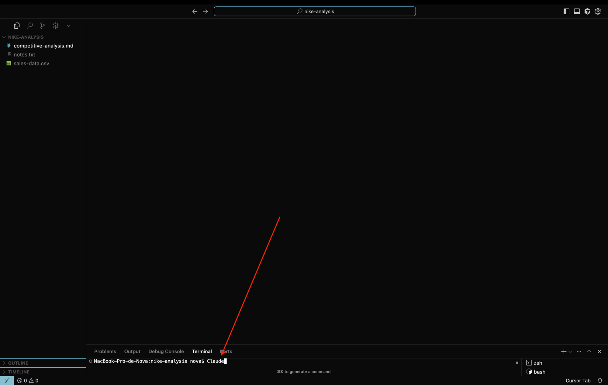
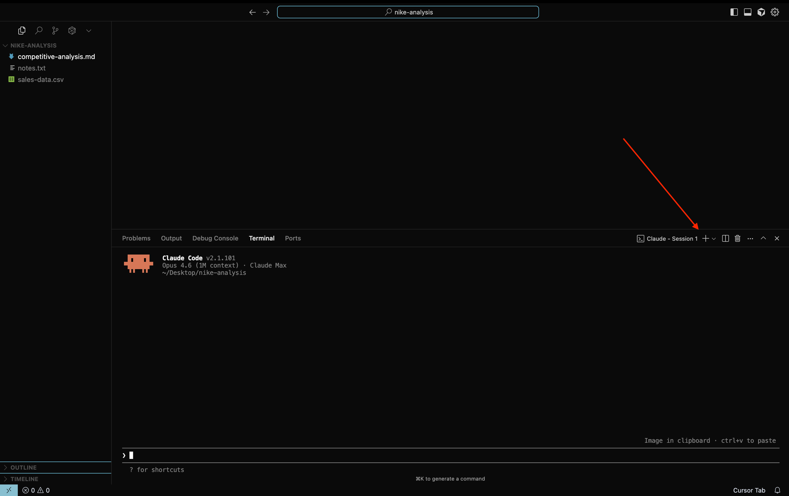
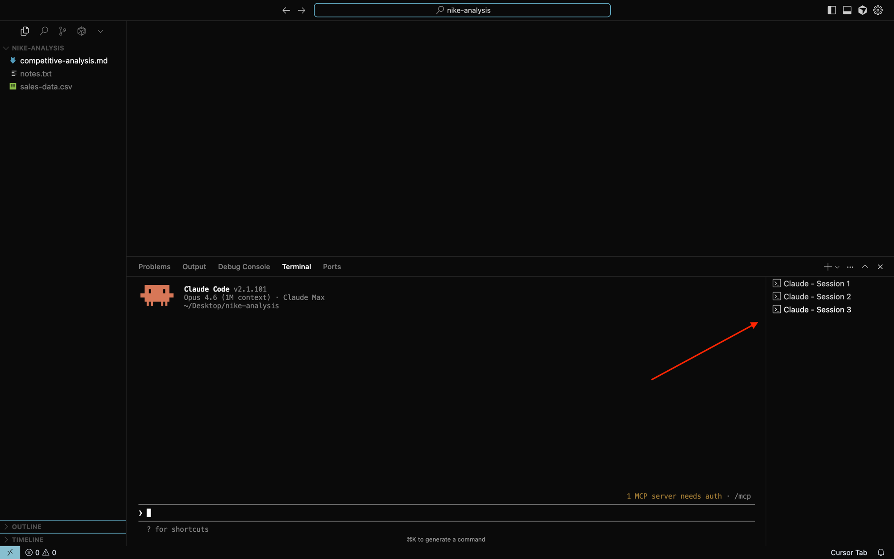

# Install & Open Claude Code

## What you need

Before starting, make sure you have:

- **Cursor open** with the `nike-analysis` folder (the one you downloaded in the [Cursor lesson](../00f-cursor/))
- A [Claude subscription](https://claude.com/pricing) (Pro, Max, or Teams)

## Step 1: Install Claude Code

Open the terminal inside Cursor (**Cmd+J** on Mac, **Ctrl+J** on Windows) and paste this command:

**Mac / Linux:**
```bash
curl -fsSL https://claude.ai/install.sh | bash
```

**Windows PowerShell:**
```powershell
irm https://claude.ai/install.ps1 | iex
```

That's it. It installs automatically and keeps itself up to date.

> **Important: close Cursor completely and reopen it** after installing. Opening a new terminal isn't enough — Cursor needs to reload its environment variables. Once reopened, type `claude` and it should start.

> **Installation issues? Don't panic.** If you see errors, copy the terminal output and paste it into [claude.ai](https://claude.ai) (the browser chat). Describe what you were trying to do and Claude will walk you through the fix.
>
> ⚠️ **Heads up about what claude.ai may suggest:** the browser chat sometimes recommends installing Claude Code with `npm install -g @anthropic-ai/claude-code`. **Don't do this on Windows** — that path depends on Node.js, on PATH configuration, and ends in "command not found". If it suggests that, ignore it and re-run the `irm https://claude.ai/install.ps1 | iex` command above — that's the official installer and it doesn't need Node. On Mac/Linux, always use `curl ... install.sh | bash`.

## Step 2: Open Claude Code

You should already have the `nike-analysis` folder open in Cursor from the [previous lesson](../00f-cursor/). If not, open it now: **File → Open Folder → Desktop → nike-analysis**.

The terminal is just the **bottom panel** in Cursor — think of it as a chat window that happens to be at the bottom of your editor. Open it with **Cmd+J** (Mac) or **Ctrl+J** (Windows) and type:

```
claude
```



The first time, you'll be asked to log in. Follow the prompts — it opens your browser to authenticate.

> **Important:** you can't click with your mouse to select options in the terminal. Use the **arrow keys** (up/down) to move between options and **Enter** to confirm.

Once logged in, you'll see the Nike project files on the left and Claude ready to chat at the bottom:


You're in! That cursor at the bottom is where you type your requests.

## Step 3: Ask your first question

Remember the Nike files you explored in Cursor? Now let's ask Claude about them. Just type in plain English. Try any of these:

> `summarize the competitive analysis`

> `what are Nike's main strengths and threats?`

> `analyze the sales data and tell me which region grew the most`

Claude will read the files and give you a detailed answer. No setup needed — it just works.

> **You talk to Claude like a colleague.** No special syntax, no programming language. Just describe what you want.

## Step 4: Make your first change

Now ask Claude to modify one of the files:

> `add a section about Nike's digital strategy to the competitive analysis`

Claude will think about what to write, then show you the proposed changes and ask for permission:


You'll see three options:
1. **Yes** — approve this one change
2. **Yes, allow all edits during this session (shift+tab)** — approve this change and let Claude make similar edits without asking again. **This is the recommended option** — it keeps things flowing without interruptions.
3. **No** — reject the change

Pick option 2, and you'll see the file update in Cursor immediately.

> **Claude always asks before changing things.** You stay in control. If you ever want to stop Claude mid-action, press `Esc`.

## Step 5: Try more tasks

Here are more things you can ask Claude about the Nike project:

### Analyze data

> `read the sales CSV and create a summary table by region with total revenue and average growth`

> `which quarter had the best performance overall?`

### Extract insights

> `based on the meeting notes and competitive analysis, what should Nike prioritize next quarter?`

> `write 3 bullet points I can share with my team about Nike's biggest risks`

### Create new content

> `create a one-page executive summary combining the competitive analysis and sales data`

> `draft an email to the team summarizing the key findings from the Nike analysis`

## When something goes wrong

**The terminal shows an error you don't understand?**

Don't worry. Just select the error text, copy it, and paste it directly into Claude:

> `I got this error: [paste the error]. What does it mean and how do I fix it?`

Claude will explain what happened and walk you through the fix. You can also paste errors into [claude.ai](https://claude.ai) (the browser chat) or the [Desktop App](https://claude.com/download).

**Claude isn't starting?**

If you type `claude` and see "command not found", go back to Step 1 and make sure the installation completed. Remember to close and reopen Cursor after installing.

**The panel closed?**

Press **Cmd + J** (Mac) or **Ctrl + J** (Windows) again to reopen it. Claude will still be running.

## Essential commands and shortcuts

| What to type | What it does |
|-------------|-------------|
| `claude` | Start a new session |
| `claude -c` | Continue your last conversation |
| `/help` | See all available commands |
| `Esc` | Stop Claude mid-action |
| `exit` or `Ctrl+C` | Exit Claude Code |
| **Cmd/Ctrl + J** | Open or close the terminal panel |
| **Up arrow** | Show your previous message |

## Power tip: Run multiple sessions in parallel

You're not limited to one Claude conversation at a time. In Cursor, you can open multiple terminals — each one running its own Claude Code session with its own conversation thread.

**How to do it:**

1. Click the **+** icon in the terminal panel to open a new terminal



2. Type `claude` in the new terminal to start a second session
3. Repeat as many times as you want



Now you can have Claude working on three things simultaneously:
- **Terminal 1**: Analyzing your sales data
- **Terminal 2**: Rewriting the competitive analysis
- **Terminal 3**: Drafting an email summary

Each session is independent — they don't interfere with each other. This is one of the biggest productivity gains with Claude Code: while Claude is working on a big task in one terminal, you can start something else in another.

> **Think of it like having multiple assistants instead of one.** Each terminal is its own specialist working on its own task.

## Organizing your workspace

Before you start creating more projects, set up a simple folder structure. This keeps everything clean and helps Claude work better — it performs best when each project has its own focused folder.

### Step 1: Create the main folder

Create a folder called **`Claude`** on your Desktop:

- **Mac**: right-click on Desktop → New Folder → name it `Claude`
- **Windows**: right-click on Desktop → New → Folder → name it `Claude`

### Step 2: Create the structure inside

Open the `Claude` folder and create two folders inside it the same way (right-click → New Folder):

- `projects`
- `resources`

Then move the `nike-analysis` folder from your Desktop into `projects/` (just drag and drop).

### Step 3: Open it in Cursor

Open the `Claude` folder in Cursor (**File → Open Folder** → find your Desktop → select `Claude`). You'll see everything organized in the sidebar.

### The structure

This is what your workspace should look like over time:

```
~/Desktop/Claude/
├── projects/                    ← one folder per project
│   ├── nike-analysis/
│   │   ├── competitive-analysis.md
│   │   ├── notes.txt
│   │   └── sales-data.csv
│   ├── q4-planning/
│   └── client-acme/
└── resources/                   ← shared across all projects
    ├── brand-guidelines.md
    └── competitor-list.csv
```

**`projects/`** is where your work lives. Each project gets its own folder — put your files and Claude's results all together in it.

**`resources/`** is for reference material that applies across projects — brand guidelines, pricing sheets, competitor data. When Claude needs this info, you can tell it: "check the resources folder for our brand guidelines."

### The rules

1. **One folder per project** — Claude works best with focused context. Don't mix Nike files with Q4 planning files.
2. **`resources/`** for shared material — things that don't belong to any single project.

### Starting a new project

Every time you start something new, create a folder inside `projects/`. Just use Finder (Mac) or File Explorer (Windows):

1. Open `Desktop/Claude/projects/`
2. Create a new folder with your project name (e.g., `my-new-project`)
3. Drop your files inside it

Open the project folder in Cursor (**File → Open Folder**), open the terminal panel (**Cmd+J** / **Ctrl+J**), type `claude`, and you're ready to work.

> **The payoff compounds.** After a few weeks, you'll have a clean library of projects. You can jump between any of them and Claude immediately picks up where you left off.

> **Later in the course** you'll learn how to give each project its own memory so Claude remembers context between sessions.

## What's next?
