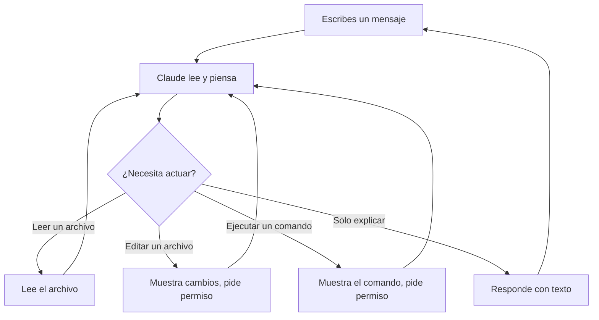

# Cómo Funciona Claude Code

## El panorama general

Claude Code es un **asistente de IA que vive en tu terminal**. Puede leer tus archivos, hacer cambios, ejecutar comandos y resolver problemas — mientras tú observas y lo guías.

Piensa en ello como tener un colega muy capaz sentado a tu lado que puede:
- Leer y entender cualquier archivo en tu proyecto
- Hacer ediciones en múltiples archivos a la vez
- Ejecutar comandos en tu computadora
- Explicar cosas en español simple

## El ciclo de conversación

Cada interacción sigue un ciclo simple:

1. **Tú escribes** un mensaje en español simple
2. **Claude piensa** en qué hacer
3. **Claude actúa** — lee archivos, propone ediciones o ejecuta comandos
4. **Tú apruebas** cualquier cambio (Claude siempre pregunta primero)
5. **Repite** hasta que la tarea esté completa

## Espera iteración, no perfección

Claude no siempre acertará a la primera — y eso es completamente normal. El valor de la IA no es la perfección al primer intento, es la **velocidad de iteración**.

Una persona podría pasar 2 horas creando un informe perfecto. Claude llega al 80% en 2 minutos, luego al 90% después de tu primera corrección, y al 95% después de la segunda. En 5-10 minutos, tienes un resultado que habría tomado mucho más tiempo a mano.

**La mentalidad correcta:** No juzgues a Claude por su primer resultado. Júzgalo por lo rápido que llega a "suficientemente bueno" con tu guía.

> **Tip: Observa cómo piensa Claude.** Mientras Claude trabaja, puedes hacer clic en la etiqueta **"thinking"** para ver su razonamiento interno — qué planea hacer, qué archivos está considerando y cómo está abordando tu solicitud. Esto te ayuda a entender qué está pasando y cuándo corregir el rumbo.

## Qué puede hacer Claude

### Leer archivos
Claude puede abrir y leer cualquier archivo en tu proyecto — informes, hojas de cálculo, notas de reunión, propuestas. Lo hace automáticamente cuando necesita contexto.

### Editar archivos
Claude puede modificar archivos — actualizar un análisis competitivo, agregar secciones a un informe, o corregir datos en un CSV. Siempre te muestra los cambios y pide permiso.

### Ejecutar comandos
Claude puede ejecutar comandos de terminal en tu computadora. Pregunta primero antes de ejecutar cualquier cosa.

### Buscar en tus archivos
Claude puede buscar en todos tus archivos para encontrar información específica — como cada mención de un nombre de cliente, una cifra de precios, o una fecha límite.

### Buscar en Internet
Claude puede buscar en Internet para encontrar información actual — webs de competidores, datos de mercado, noticias, documentación. Puedes pedirle que busque algo y traerá los resultados directamente a tu conversación, combinando lo que encuentra online con los archivos de tu proyecto.

## Qué viene ahora

Esta lección te dio el modelo mental. Las siguientes lecciones se centran en tres cosas que marcan una gran diferencia en tu día a día:

- **[La Ventana de Contexto](/es/lessons/context-window)** — la memoria a corto plazo de Claude, por qué importa y cómo manejarla.
- **[Modelos](/es/lessons/models)** — Haiku vs Sonnet vs Opus, y el ajuste de esfuerzo que controla cuánto piensa Claude.
- **[Modo Plan](/es/lessons/plan-mode)** — la forma más segura de dejar que Claude analice tu proyecto sin tocar nada.

## Puntos clave

1. **No esperes perfección al primer intento** — el valor de la IA es la velocidad de iteración, no acertar a la primera.
2. **Claude siempre pregunta antes de actuar** — tú apruebas cada cambio, nunca pierdes el control.
3. **Claude trabaja en un ciclo**: tú guías, él piensa, actúa, tú apruebas, repite.
4. **`/clear` es tu mejor amigo** — úsalo cada vez que cambies de tema.
