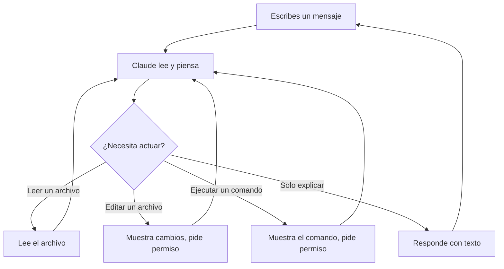

# Cómo Funciona Claude Code

## El panorama general

Claude Code es un **asistente de IA que vive en tu terminal**. Puede leer tus archivos, hacer cambios, ejecutar comandos y resolver problemas — mientras tu observas y lo guias.

Piensa en ello como tener un colega muy capaz sentado a tu lado que puede:
- Leer y entender cualquier archivo en tu proyecto
- Hacer ediciones en multiples archivos a la vez
- Ejecutar comandos en tu computadora
- Explicar cosas en español simple

## El ciclo de conversación

Cada interaccion sigue un ciclo simple:

1. **Tu escribes** un mensaje en español simple
2. **Claude piensa** en que hacer
3. **Claude actua** — lee archivos, propone ediciones o ejecuta comandos
4. **Tu apruebas** cualquier cambio (Claude siempre pregunta primero)
5. **Repite** hasta que la tarea este completa

## Qué puede hacer Claude

### Leer archivos
Claude puede abrir y leer cualquier archivo en tu proyecto — informes, hojas de cálculo, notas de reunión, propuestas. Lo hace automáticamente cuando necesita contexto.

### Editar archivos
Claude puede modificar archivos — actualizar un análisis competitivo, agregar secciones a un informe, o corregir datos en un CSV. Siempre te muestra los cambios y pide permiso.

### Ejecutar comandos
Claude puede ejecutar comandos de terminal en tu computadora. Pregunta primero antes de ejecutar cualquier cosa.

### Buscar en tus archivos
Claude puede buscar en todos tus archivos para encontrar información específica — como cada mención de un nombre de cliente, una cifra de precios, o una fecha límite.

### Buscar en Internet
Claude puede buscar en Internet para encontrar información actual — webs de competidores, datos de mercado, noticias, documentación. Puedes pedirle que busque algo y traerá los resultados directamente a tu conversación, combinando lo que encuentra online con los archivos de tu proyecto.

## La ventana de contexto

Claude tiene una **ventana de contexto** — piensa en ella como la memoria a corto plazo de Claude para tu conversación.

Todo entra en está memoria:
- Tus mensajes
- Archivos que Claude lee
- Salidas de comandos
- Respuestas de Claude

Esta memoria tiene un límite. Cuando se llena, la calidad de Claude se degrada:

- Al **70% llena** — la calidad empieza a bajar, las respuestas se vuelven menos precisas
- Al **85% llena** — errores frecuentes, Claude pierde detalles importantes
- Al **90%+** — Claude olvida partes clave de la conversación

Puedes verificar cuánto contexto has usado escribiendo `/context`.

### Cómo manejarla

| Problema | Solución |
|---------|----------|
| La conversación se hace larga | Escribe `/clear` para empezar de cero |
| Claude olvido algo que dijiste antes | Recuerdaselo, o inicia una nueva sesión |
| Claude parece confundido | Escribe `/clear` y reformula tu solicitud |

> **Regla general**: Si vas a cambiar a un tema completamente diferente, empieza con `/clear`. Es como abrir un documento nuevo en lugar de agregar a uno que ya está muy largo.

## Comandos útiles

Claude Code tiene algunos comandos integrados que empiezan con `/`. No necesitas memorizar muchos — solo estos:

| Comando | Qué hace |
|---------|----------|
| `/clear` | Empieza una conversación nueva (¡úsalo seguido!) |
| `/memory` | Abre tus archivos de memoria — donde Claude guarda lo que debe recordar sobre ti y tu proyecto |
| `/compact` | Resume una conversación larga para liberar espacio |
| `/help` | Muestra todos los comandos disponibles |
| `/model` | Cambia entre modelos de Claude (Haiku, Sonnet, Opus) |

Recomendamos usar **Opus 4.6** — es el modelo más capaz y produce los mejores resultados. Puedes ver qué modelo estás usando en la parte inferior de la pantalla de Claude Code, y cambiarlo con `/model` si es necesario.

Aprenderás más sobre `/memory` en la lección de Memoria. Por ahora, el más importante es `/clear` — úsalo cada vez que cambies de tema.

## Permisos: siempre tienes el control

Claude Code tiene tres modos:

| Modo | Qué significa |
|------|--------------|
| **Normal** (predeterminado) | Claude pide permiso para cada cambio |
| **Auto-aceptar** | Claude hace cambios sin preguntar (usar con precaución) |
| **Modo plan** | Claude solo lee y planifica — no se permiten cambios |

Presiona **Shift+Tab** para alternar entre modos. La mayoría de las personas empiezan en modo Normal.

> **El modo plan es genial para aprender.** Puedes pedirle a Claude que analice tu proyecto sin riesgo de cambios.

## Dónde se guardan las cosas

- **Las conversaciones** se guardan localmente en tu computadora
- **La configuración** vive en `~/.claude/` (tu carpeta de inicio)
- **La configuración del proyecto** vive en `.claude/` dentro de tu carpeta de proyecto

Nada se envía a la nube excepto tus mensajes a Claude (igual que usar ChatGPT o cualquier chat de IA).

## Puntos clave

1. **Habla naturalmente** — Claude entiende español simple
2. **Claude siempre pregunta** antes de hacer cambios
3. **Usa `/clear` seguido** — contexto fresco = mejores resultados
4. **El modo plan es seguro** — Claude solo puede leer, no escribir
5. **Todo es reversible** — Claude crea puntos de control a los que puedes regresar
