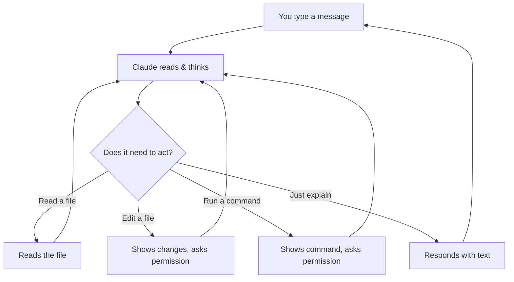

# How Claude Code Works

## The big picture

Claude Code is an **AI assistant that lives in your terminal**. It can read your files, make changes, run commands, and work through problems — while you watch and guide it.

Think of it as having a very capable colleague sitting next to you who can:
- Read and understand any file in your project
- Make edits across multiple files at once
- Run commands on your computer
- Explain things in plain English

## The conversation loop

Every interaction follows a simple loop:



1. **You type** a message in plain English
2. **Claude thinks** about what to do
3. **Claude acts** — reads files, proposes edits, or runs commands
4. **You approve** any changes (Claude always asks first)
5. **Repeat** until the task is done

## Expect iteration, not perfection

Claude won't always get it right on the first try — and that's completely normal. The value of AI isn't one-shot perfection, it's **speed of iteration**.

A human might spend 2 hours crafting a perfect report. Claude gets to 80% in 2 minutes, then 90% after your first correction, then 95% after the second. Within 5-10 minutes, you're at a result that would have taken much longer by hand.

**The right mindset:** Don't judge Claude by its first output. Judge it by how fast it gets to "good enough" with your guidance.

> **Tip: Watch Claude think.** While Claude is working, you can click on the **"thinking"** label to see its internal reasoning — what it's planning to do, what files it's considering, and how it's approaching your request. This helps you understand what's happening and when to course-correct.

## What Claude can do

### Read files
Claude can open and read any file in your project — reports, spreadsheets, meeting notes, proposals. It does this automatically when it needs context.

### Edit files
Claude can modify files — updating a competitive analysis, adding sections to a report, or fixing data in a CSV. It always shows you the changes and asks for permission.

### Run commands
Claude can execute terminal commands on your computer. It asks first before running anything.

### Search your files
Claude can search through all your files to find specific information — like every mention of a client name, a pricing figure, or a deadline.

### Search the web
Claude can search the internet to find current information — competitor websites, market data, news, documentation. You can ask it to look something up and it will bring the results directly into your conversation, combining what it finds online with your local project files.

## The context window

Claude has a **context window** — think of it as Claude's short-term memory for your conversation.

Everything goes into this memory:
- Your messages
- Files Claude reads
- Command outputs
- Claude's responses

This memory has a limit. When it fills up, Claude's quality degrades:

- At **70% full** — quality starts dropping, responses become less precise
- At **85% full** — frequent errors, Claude misses important details
- At **90%+** — Claude forgets key parts of the conversation

You can check how full your context is by typing `/context`.

### Auto-compaction

When your conversation gets very long, Claude automatically compresses older messages into high-density summaries. This happens in the background — you don't need to do anything. It preserves the important information while freeing up space for new work.

You can also trigger this manually with `/compact` if you want to free up space without starting over.

### How to manage it

| Problem | Solution |
|---------|----------|
| Conversation getting long | Type `/clear` to start fresh |
| Claude forgot something you said earlier | Remind it, or start a new session |
| Claude seems confused | Type `/clear` and rephrase your request |

> **Rule of thumb**: If you're switching to a completely different topic, start with `/clear`. It's like opening a fresh document instead of adding to an already long one.

## Useful commands

Claude Code has a few built-in commands that start with `/`. You don't need to memorize many — just these:

| Command | What it does |
|---------|-------------|
| `/clear` | Starts a fresh conversation (use this often!) |
| `/memory` | Opens your memory files — where Claude stores what it should remember about you and your project |
| `/compact` | Summarizes a long conversation to free up space |
| `/help` | Shows all available commands |
| `/model` | Switches between Claude models (Haiku, Sonnet, Opus) |

We recommend using **Opus 4.6** — it's the most capable model and produces the best results. You can check which model you're using at the bottom of the Claude Code screen, and switch with `/model` if needed.

### Effort level: always set it to max

Besides choosing the model, Claude has an **effort level** setting (`/effort`) that controls how much it reasons before answering. By default, Claude tends to put you on `medium` to consume fewer tokens — but we recommend always keeping it at max for the best responses.

You have several ways to set it as default:

**Environment variable (most reliable, always persists):**

```bash
export CLAUDE_CODE_EFFORT_LEVEL=max
```

Add that line to your `.bashrc` or `.zshrc` so it applies in every session.

**Settings file:** Add `"effortLevel": "max"` in your Claude Code configuration file.

**Per-session command:** Type `/effort max` in Claude Code. The levels `low`, `medium`, and `high` persist between sessions, but `max` does not persist between sessions except through the environment variable.

> **Note:** `max` is only available on Opus 4.6 — using it with Sonnet will throw an error.

You'll learn more about `/memory` in the Memory lesson. For now, the most important one is `/clear` — use it every time you switch topics.

## Permissions: you're always in control

Claude Code has three modes:

| Mode | What it means |
|------|--------------|
| **Normal** (default) | Claude asks permission for every change |
| **Auto-accept** | Claude makes changes without asking (use with caution) |
| **Plan mode** | Claude only reads and plans — no changes allowed |

Press **Shift+Tab** to cycle between modes. Most people start in Normal mode.

> **Plan mode is great for learning.** You can ask Claude to analyze your project without any risk of changes.

## Where things are saved

- **Conversations** are saved locally on your computer
- **Settings** live in `~/.claude/` (your home folder)
- **Project settings** live in `.claude/` inside your project folder

Nothing is sent to the cloud except your messages to Claude (just like using ChatGPT or any AI chat).

## How much does it cost?

Claude Code uses tokens (think of them as words) every time you have a conversation. Your subscription includes a monthly token allowance.

**Check your session cost:** Type `/cost` in Claude Code to see how many tokens you've used in the current session.

**Check your monthly usage:** Go to [claude.ai](https://claude.ai) → Settings → Usage to see your overall consumption and how much of your monthly allowance you've used.

> **Good to know:** Reading large files and working with images uses more tokens than simple text conversations. If you're working on a big project, keep an eye on your usage with `/cost`.

## Key takeaways

1. **Talk naturally** — Claude understands plain English
2. **Claude always asks** before making changes
3. **Use `/clear` often** — fresh context = better results
4. **Plan mode is safe** — Claude can only read, not write
5. **Everything is reversible** — Claude creates checkpoints you can rewind to

