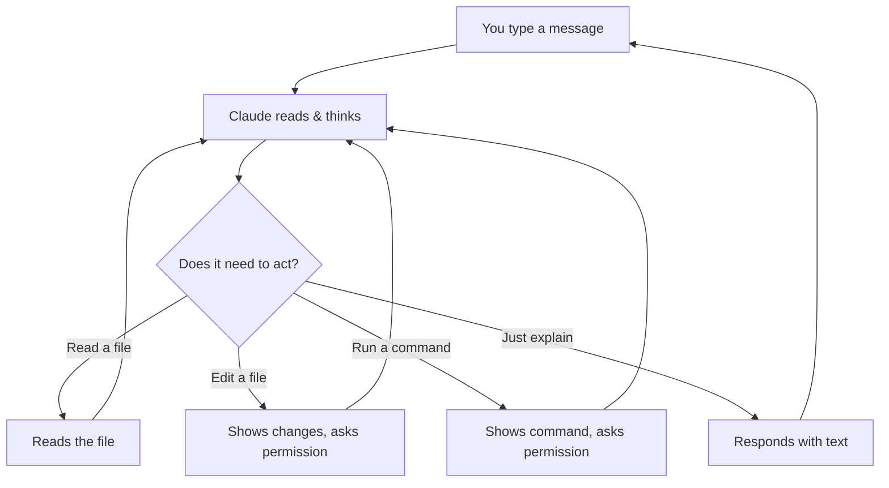

# How Claude Code Works

## The big picture

Claude Code is an **AI assistant that lives in your terminal**. It can read your files, make changes, run commands, and work through problems — while you watch and guide it.

Think of it as having a very capable colleague sitting next to you who can:
- Read and understand any file in your project
- Make edits across multiple files at once
- Run commands on your computer
- Explain things in plain English

## The conversation loop

Every interaction follows a simple loop:

1. **You type** a message in plain English
2. **Claude thinks** about what to do
3. **Claude acts** — reads files, proposes edits, or runs commands
4. **You approve** any changes (Claude always asks first)
5. **Repeat** until the task is done

## What Claude can do

### Read files
Claude can open and read any file in your project. It does this automatically when it needs context.

### Edit files
Claude can modify files — adding, changing, or removing content. It always shows you the changes and asks for permission.

### Run commands
Claude can execute terminal commands — like running tests, installing packages, or checking Git status. Again, it asks first.

### Search your codebase
Claude can search through all your files to find specific text, patterns, or functionality.

## The context window

Claude has a **context window** — think of it as Claude's short-term memory for your conversation.

Everything goes into this memory:
- Your messages
- Files Claude reads
- Command outputs
- Claude's responses

This memory has a limit. When it fills up, Claude may start forgetting earlier parts of the conversation.

### How to manage it

| Problem | Solution |
|---------|----------|
| Conversation getting long | Type `/clear` to start fresh |
| Claude forgot something you said earlier | Remind it, or start a new session |
| Claude seems confused | Type `/clear` and rephrase your request |

> **Rule of thumb**: If you're switching to a completely different topic, start with `/clear`. It's like opening a fresh document instead of adding to an already long one.

## Useful commands

Claude Code has a few built-in commands that start with `/`. You don't need to memorize many — just these:

| Command | What it does |
|---------|-------------|
| `/clear` | Starts a fresh conversation (use this often!) |
| `/memory` | Opens your memory files — where Claude stores what it should remember about you and your project |
| `/compact` | Summarizes a long conversation to free up space |
| `/help` | Shows all available commands |
| `/model` | Switches between Claude models (Haiku, Sonnet, Opus) |

We recommend using **Opus 4.6** — it's the most capable model and produces the best results. You can check which model you're using at the bottom of the Claude Code screen, and switch with `/model` if needed.

You'll learn more about `/memory` in the Memory lesson. For now, the most important one is `/clear` — use it every time you switch topics.

## Permissions: you're always in control

Claude Code has three modes:

| Mode | What it means |
|------|--------------|
| **Normal** (default) | Claude asks permission for every change |
| **Auto-accept** | Claude makes changes without asking (use with caution) |
| **Plan mode** | Claude only reads and plans — no changes allowed |

Press **Shift+Tab** to cycle between modes. Most people start in Normal mode.

> **Plan mode is great for learning.** You can ask Claude to analyze your project without any risk of changes.

## Where things are saved

- **Conversations** are saved locally on your computer
- **Settings** live in `~/.claude/` (your home folder)
- **Project settings** live in `.claude/` inside your project folder

Nothing is sent to the cloud except your messages to Claude (just like using ChatGPT or any AI chat).

## Key takeaways

1. **Talk naturally** — Claude understands plain English
2. **Claude always asks** before making changes
3. **Use `/clear` often** — fresh context = better results
4. **Plan mode is safe** — Claude can only read, not write
5. **Everything is reversible** — Claude creates checkpoints you can rewind to

**Next step**: [Learn the golden rules to get great results from Claude →](../00d-best-practices/)
