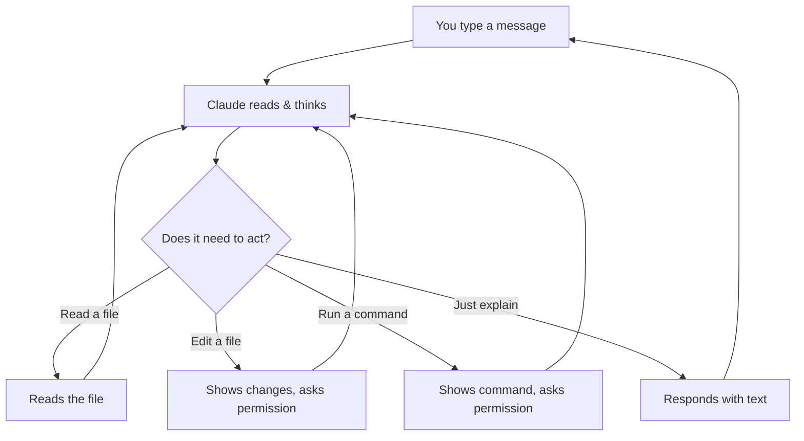

# How Claude Code Works

## The big picture

Claude Code is an **AI assistant that lives in your terminal**. It can read your files, make changes, run commands, and work through problems — while you watch and guide it.

Think of it as having a very capable colleague sitting next to you who can:
- Read and understand any file in your project
- Make edits across multiple files at once
- Run commands on your computer
- Explain things in plain English

## The conversation loop

Every interaction follows a simple loop:

1. **You type** a message in plain English
2. **Claude thinks** about what to do
3. **Claude acts** — reads files, proposes edits, or runs commands
4. **You approve** any changes (Claude always asks first)
5. **Repeat** until the task is done

## Expect iteration, not perfection

Claude won't always get it right on the first try — and that's completely normal. The value of AI isn't one-shot perfection, it's **speed of iteration**.

A human might spend 2 hours crafting a perfect report. Claude gets to 80% in 2 minutes, then 90% after your first correction, then 95% after the second. Within 5-10 minutes, you're at a result that would have taken much longer by hand.

**The right mindset:** Don't judge Claude by its first output. Judge it by how fast it gets to "good enough" with your guidance.

> **Tip: Watch Claude think.** While Claude is working, you can click on the **"thinking"** label to see its internal reasoning — what it's planning to do, what files it's considering, and how it's approaching your request. This helps you understand what's happening and when to course-correct.

## What Claude can do

### Read files
Claude can open and read any file in your project — reports, spreadsheets, meeting notes, proposals. It does this automatically when it needs context.

### Edit files
Claude can modify files — updating a competitive analysis, adding sections to a report, or fixing data in a CSV. It always shows you the changes and asks for permission.

### Run commands
Claude can execute terminal commands on your computer. It asks first before running anything.

### Search your files
Claude can search through all your files to find specific information — like every mention of a client name, a pricing figure, or a deadline.

### Search the web
Claude can search the internet to find current information — competitor websites, market data, news, documentation. You can ask it to look something up and it will bring the results directly into your conversation, combining what it finds online with your local project files.

## What's next

This lesson gave you the mental model. The next few lessons zoom in on three things that make a huge difference in your day-to-day:

- **[The Context Window](/en/lessons/context-window)** — Claude's short-term memory, why it matters, and how to manage it.
- **[Models](/en/lessons/models)** — Haiku vs Sonnet vs Opus, and the effort setting that controls how hard Claude thinks.
- **[Plan Mode](/en/lessons/plan-mode)** — the safest way to let Claude analyze your project without touching anything.

## Key takeaways

1. **Don't expect perfection on the first try** — the value of AI is iteration speed, not getting it right the first time.
2. **Claude always asks before acting** — you approve every change, you never lose control.
3. **Claude works in a loop**: you guide, it thinks, it acts, you approve, repeat.
4. **`/clear` is your best friend** — use it every time you switch topics.
