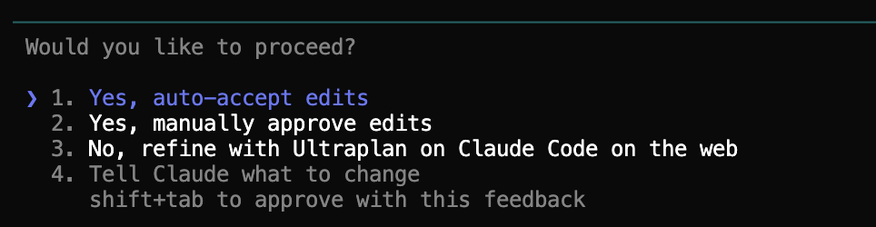

# Best Practices

## Start with a plan

Before making changes, always start in **Plan Mode**. You have two ways to activate it:

- **Keyboard shortcut:** Press **Shift+Tab** twice — you'll see the mode indicator change at the bottom. Works on Mac, Windows, and Linux.
- **In plain language:** Just tell Claude *"switch to plan mode"* or *"ponte en modo plan"*. Claude understands the instruction and switches modes.

In Plan Mode, Claude can only read and analyze — it won't modify any files. This is the best way to start any task because Claude will think through the approach before doing anything.

The data backs this up: **tasks started with Plan Mode succeed on the first try 77% of the time**, compared to just 40% when jumping straight to changes. Planning first nearly doubles your success rate.

### Try it: plan a Nike market report

Open Claude Code in your `nike-analysis` folder and activate Plan Mode (Shift+Tab twice, or just tell Claude *"switch to plan mode"*). Then type:

> `I want to turn this competitive analysis into a full market report. Plan what sections to add, what data from the CSV to include, and how to structure the final document.`

Claude will read your files and propose a detailed plan — without changing anything. You can review it, ask questions, and adjust before any work begins.

When the plan looks good, Claude will offer you several options to continue:



The options mean:

1. **Yes, auto-accept edits** — Claude executes the plan and applies all changes without asking permission at each step. The fastest option.
2. **Yes, manually approve edits** — Claude executes the plan but asks for confirmation before each change. More control, slower.
3. **No, refine with Ultraplan** — Claude refines the plan in more detail before executing. Useful if the plan feels too vague.
4. **Tell Claude what to change** — Lets you give feedback on the plan before executing. E.g. "remove section 3" or "start with the CSV".

Just click the option you prefer and Claude will start working.

This **plan first, execute second** approach gives you much better results than jumping straight to changes.

## Let Claude explore first

Before asking for changes, let Claude understand the project:

```
Read through the project and explain the structure
to me like I'm a product manager.
```

Then:

```
Now that you understand the project, change the
pricing tier names from Basic/Pro/Enterprise
to Starter/Growth/Scale.
```

This two-step approach gets much better results than jumping straight to changes.

## The interview technique

For bigger tasks, let Claude ask YOU questions first:

```
I want to redesign our onboarding flow. Interview me
about what I have in mind — ask about goals, user types,
and constraints before making any changes.
```

Claude will ask smart questions about things you might not have considered. Once aligned, it can execute with much more precision.

## Keep conversations focused (this saves you real money)

Every message you send reprocesses the ENTIRE previous conversation. A 10-turn chat silently multiplies your token spend by 10x. This is the number one hidden cost for most users.

**Do this:**
- One topic per session
- Type `/clear` when switching topics
- Keep your requests focused
- Use `/cost` to check your current session's token usage

**Avoid this:**
- Asking about authentication, then pricing, then design, then bugs — all in one session
- Very long sessions without clearing
- Continuing a conversation "just because" when you've already moved on to a different task

## The two-correction rule

If you correct Claude twice on the same issue and it's still not getting it right, **stop correcting and start over**. Type `/clear` and rewrite your prompt from scratch — this time being more specific about what you want.

Continuing to correct a confused Claude wastes time. A fresh, well-written prompt gets better results faster than a chain of corrections.

## Monitor, don't micromanage

When Claude is working on a big task, let it work. Don't interrupt every 10 seconds with corrections — this breaks its flow and wastes context.

Instead:
- **Watch the thinking tab** to see what Claude is planning
- **Wait for it to finish** before giving feedback
- **Give all your corrections at once** instead of one at a time

Think of it like delegating to a colleague: you hand off the task, check in when they're done, and give feedback in one batch. Constant interruptions make everyone slower.

## Summary: the golden rules

1. **Start with a plan** — Plan Mode before making changes (77% success vs 40%)
2. **Explore first** — let Claude understand the project before asking for changes
3. **One topic per session** — `/clear` when switching topics, each message reprocesses everything
4. **The 2-correction rule** — if you correct the same thing twice, `/clear` and rewrite the prompt
5. **Interview technique** — for big tasks, let Claude ask you questions first
6. **Don't micromanage** — let it finish, then give all feedback at once

