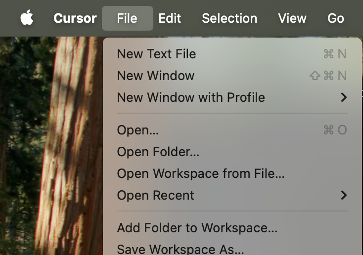
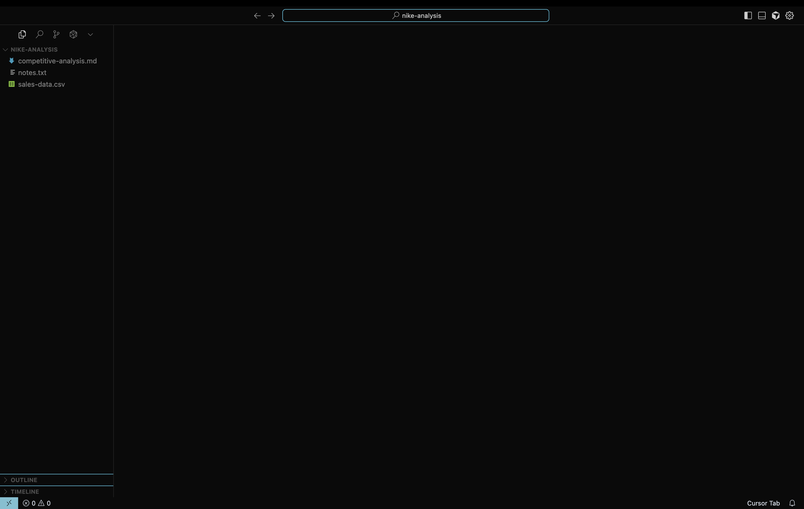
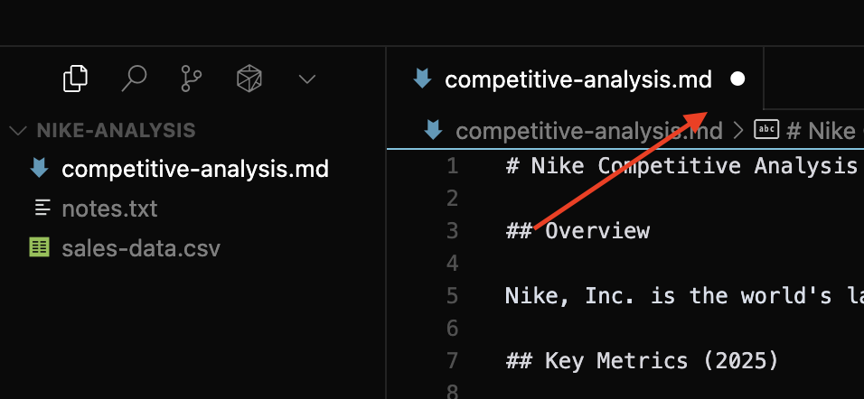
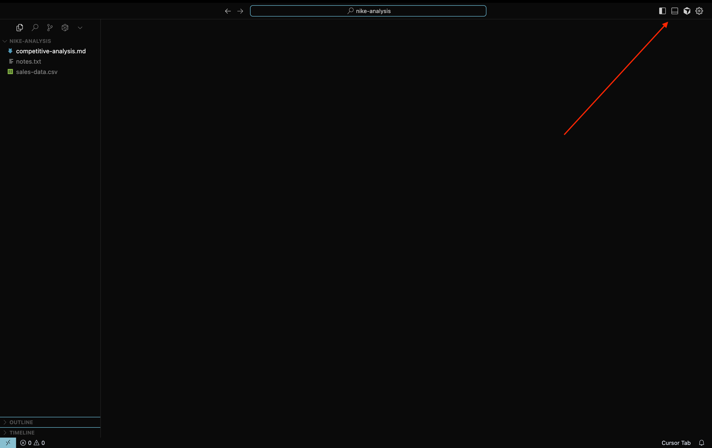

# Cursor

## Why Cursor?

Cursor is where you'll do everything in this course. It's a **free code editor** that combines:
- A **file browser** to see all your project files
- A **text editor** to view and edit any file
- A **built-in terminal** to run Claude Code

All in one window. Instead of switching between apps, you have everything together — you can see the files Claude is changing while you talk to it.

> **This is your work environment for the entire course.** We'll use Cursor for everything — editing files, running the terminal, and talking to Claude.

## Installing Cursor

### Download

1. Go to [cursor.com](https://www.cursor.com)
2. Click the **Download** button
3. Install it like any other app

It's free and works on Mac, Windows, and Linux.

### First launch

When you open Cursor for the first time, you'll see a welcome screen:

Click **Open project** and select your Desktop folder (or any folder you like). This tells Cursor where to work — think of it as choosing which desk to sit at.

Once you open a folder, you'll see the **Explorer** on the left sidebar (it looks like two overlapping files). This is where all your project files and folders appear, just like Finder on Mac or File Explorer on Windows.

### Download the practice project

1. [Download this folder](https://github.com/cristiangarcia-eng/claude-learning/raw/main/resources/nike-analysis.zip) to your Desktop
2. Unzip it — you'll get a folder called `nike-analysis`

It's a simple competitive analysis of Nike with a few files inside.

> **Before continuing**, make sure the unzipped `nike-analysis` folder is on your Desktop. The next steps assume it's there.

### Open it in Cursor

1. Go to **File > Open Folder** (or `Cmd+O` on Mac)

2. Navigate to your **Desktop** and select the `nike-analysis` folder
3. Click **Open**

You should see the files appear in the Explorer sidebar on the left. Click any file to open it — that's it!

### What's inside

Take a look at the files in the project. You'll see three different types that are very common when working with Claude:

- **`competitive-analysis.md`** — a Markdown file. This is the most important format you'll use with Claude. Markdown (`.md`) is plain text with simple formatting (headings with `#`, bold with `**`, tables with `|`). Claude reads and writes Markdown constantly.
- **`notes.txt`** — a simple text file. Meeting notes, to-do lists, raw ideas — any plain text works.
- **`sales-data.csv`** — a CSV file (comma-separated values). This is how spreadsheet data looks as text. Claude can read, analyze, and transform CSVs for you.

Click each one to see how it looks inside Cursor.

## Saving files

When you edit a file, you'll notice a **dot** appears on the tab next to the filename. That dot means you have **unsaved changes**.

To save: press `Cmd+S` (Mac) or `Ctrl+S` (Windows).

> **Pro tip**: Go to **File > Auto Save** and enable it. Now your files save automatically — no more worrying about losing changes.

## The built-in terminal

Cursor has a terminal built right in. The easiest way to open it is pressing **Cmd+J** (Mac) or **Ctrl+J** (Windows).

You can also click the **terminal icon** in the top-right area of the window:

This means you can:
- Browse files visually in the sidebar
- Edit files in the main area
- Talk to Claude in the terminal at the bottom

All in one window. We'll use this terminal in the next lesson to start Claude Code.
