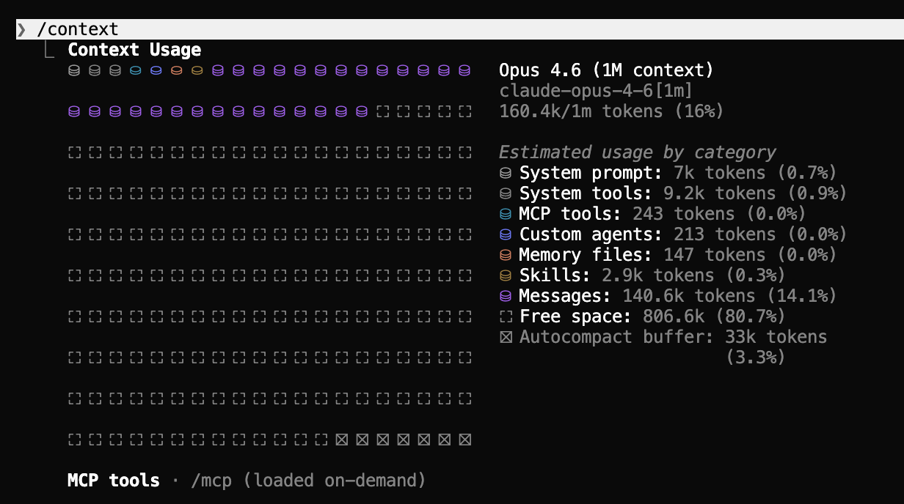

# The Context Window

Claude has a **context window** — think of it as Claude's short-term memory for your current conversation. It's the single most important thing to understand if you want Claude to stay sharp.

## What the context window is

Imagine you're in a meeting with a brilliant colleague who remembers everything said in the room. But the meeting room only has so much whiteboard space. Once the whiteboard fills up, older notes have to be erased to make room for new ones — and your colleague can only reason about what's currently visible on the board.

That's the context window. It's everything Claude is actively "thinking about" right now.

Everything gets written on the whiteboard:

- **Your messages** — every question, instruction, or correction you've sent
- **Files Claude reads** — every time Claude opens a file, its entire contents go on the board
- **Command outputs** — if Claude runs a command, the result is written down too
- **Claude's own responses** — every answer Claude gives takes up space

The more it reads and does, the fuller the board gets.

## Why this matters: quality drops as it fills up

This whiteboard has a hard limit, and **as it fills up, Claude gets worse at its job**. Not a little — noticeably. Here's roughly how it degrades:

| Context full | What happens |
|--------------|--------------|
| **Below 70%** | Sharp and accurate. Claude is at its best. |
| **Around 70%** | Quality starts slipping. Responses get less precise. |
| **Around 85%** | Frequent mistakes. Claude starts missing important details. |
| **90%+** | Claude forgets key parts of the conversation. Reliability tanks. |

This is counterintuitive: you'd think that a longer conversation gives Claude *more* context and therefore better answers. The opposite is true. After a certain point, more stuff on the whiteboard means Claude has to juggle too many things at once.

> **The big insight:** a fresh conversation with a focused task almost always beats a long, meandering one. Don't treat Claude like a single never-ending chat.

## Check how full it is: the `/context` command

You can see how much of the window you've used at any time by typing `/context` in Claude Code. You'll get something like this:



There's a lot going on in that screenshot, but you only really need to look at two things:

- **The grid on the left.** Each little square is a chunk of the context window. Filled squares = used, empty squares = still free. You can eyeball how full you are in one glance — in this example, about **16%** full, which is completely fine.
- **The percentage at the top.** Here it's `160.4k/1m tokens (16%)`. That's your headline number. **Below 70% you're golden.** Above 70% you should start thinking about `/clear` or `/compact`.

The breakdown on the right shows *what* is taking up space — your messages, files Claude has read, system tools, skills, and so on. You usually don't need to dig into this, but it's also the best way to **spot things that are silently eating your context**. For example, an unused MCP server (we'll cover MCPs in a later lesson) can easily chew through thousands of tokens before you've even sent a message — and you can disable it to get that space back. When you notice one category taking up way more than it should, `/context` is how you find it.

> **The one number that matters:** the percentage at the top. If it's below 70%, keep working. If it's creeping up, it's time to act.

## Auto-compaction: Claude cleans up for you

The good news: Claude isn't passive about this. When your conversation gets long, Claude **automatically compresses** older messages into tight summaries. The important information stays; the verbose back-and-forth gets squeezed down.

This happens quietly in the background — you don't need to do anything. You'll sometimes see a little note saying the conversation was auto-compacted, and then Claude just carries on.

## Your two main tools: clear and compact

When auto-compaction isn't enough, you have two commands that put you in control: `/clear` and `/compact`.

### Clear — start fresh

The `/clear` command **wipes the whiteboard completely** and starts a new conversation from zero. Use it when you're switching to a totally different task.

```
You: Summarize this PDF about Q3 sales
Claude: [does the work]
You: /clear
You: Now help me draft a client email about the Figma redesign
```

If you skipped the clear, the sales PDF would still be on the whiteboard eating space while you talked about Figma — wasteful and potentially confusing.

### Compact — keep going but free up space

The `/compact` command is the middle ground. It asks Claude to summarize the conversation so far into a dense summary, freeing space **without losing continuity**. Use it when you're in the middle of real work and don't want to start over, but you can feel the conversation getting heavy.

You can even guide the summary:

```
/compact focus on the decisions we made about the report structure
```

## When to use which

| Problem | What to do |
|---------|------------|
| Switching to a completely new topic | `/clear` |
| Same task but conversation is getting long | `/compact` |
| Claude forgot something you said earlier | Remind it directly, or `/clear` and start with better context |
| Claude seems confused or off-track | `/clear` and rephrase your request more clearly |

> **Rule of thumb:** If you're switching topics, `/clear`. If you're deepening on the same topic, `/compact`. When in doubt, `/clear` — it's always safe.

## Key takeaways

1. **The context window is Claude's short-term memory** — everything you send, every file Claude reads, and every response takes space.
2. **Quality drops as the window fills up** — above 70% you'll start to feel it.
3. **Type `/context`** to see how full it is.
4. **Use `/clear` when switching topics** — it's the single highest-impact habit for working with Claude.
5. **Use `/compact` when you're mid-task** and don't want to lose continuity.
