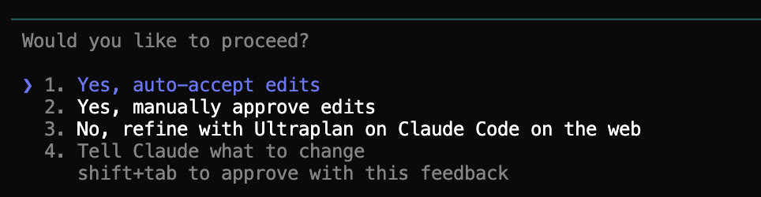

# Modo Plan

Una de las cosas que hacen que Claude Code se sienta seguro es que **siempre tienes el control**. Claude pregunta antes de hacer cambios, te muestra lo que está a punto de hacer, y nunca toca nada sin tu aprobación. Pero hay un modo aún más seguro — **el modo Plan** — que encierra a Claude en modo solo-lectura para que pueda analizar y planificar sin ningún riesgo de cambiar un solo archivo.

Esta lección recorre los tres modos que ofrece Claude Code, y por qué el modo Plan en particular es el arma secreta para aprender y explorar sin romper nada.

## Los tres modos

Claude Code tiene tres modos de permisos:

| Modo | Qué puede hacer Claude | Cuándo usarlo |
|------|------------------------|---------------|
| **Normal** (predeterminado) | Leer, editar y ejecutar comandos — pero pide permiso cada vez | Trabajo del día a día |
| **Auto-aceptar** | Leer, editar y ejecutar comandos sin preguntar | Solo cuando confías totalmente en la tarea y quieres velocidad |
| **Modo plan** | **Solo lectura.** Claude puede analizar, pensar y proponer — pero no puede cambiar nada | Explorar, aprender, decisiones importantes |

La mayoría de la gente debería empezar en modo **Normal** y quedarse ahí. Las peticiones de permiso se vuelven naturales tras unos minutos, y te mantienen al tanto.

## Cómo cambiar de modo

Cambias entre modos con un solo atajo de teclado:

**Pulsa `Shift + Tab`** para ciclar entre Normal → Auto-aceptar → Plan → Normal.

Si no tienes claro cuáles son esas teclas, aquí las tienes en un teclado estándar — `Shift` en el lado izquierdo, `Tab` justo encima:

Mantén pulsada `Shift` y toca `Tab` a la vez. Cada pulsación te lleva al siguiente modo. Verás el modo actual indicado en la interfaz de Claude Code, así siempre sabes dónde estás.

## Modo Plan: explorar sin romper nada

El modo Plan es especial. Cuando está activo, Claude **físicamente no puede modificar tus archivos ni ejecutar comandos**. Solo puede leer. Suena limitante, pero desbloquea una forma de trabajar muy potente:

- **Pide a Claude que analice** todo tu proyecto sin preocuparte de que pueda cambiar algo sin querer.
- **Deja que Claude proponga un plan** — "¿cómo reestructurarías estas carpetas?" — y obtienes un informe completo sin ningún cambio real.
- **Explora archivos desconocidos** sin riesgo. Claude puede leerlos y explicártelos todo lo que quiera.
- **Prueba un prompt del que no estás seguro** — si te preocupa que Claude pueda tomar un rumbo equivocado y empezar a editar cosas, el modo Plan elimina ese riesgo por completo.

> **El modo Plan es genial para aprender.** Cuando eres nuevo en Claude Code, ponlo en modo Plan y pídele que analice tu proyecto. Obtienes todo el beneficio de la comprensión de Claude con cero riesgo de que algo salga mal. Una vez ves su plan, puedes volver al modo Normal y ejecutarlo de verdad.

## Empieza con un plan — siempre

Antes de hacer cambios, siempre empieza en Modo Plan. Tienes dos formas de activarlo:

- **Atajo de teclado:** Presiona `Shift + Tab` **dos veces** — verás que el indicador de modo cambia en la parte inferior de la pantalla. Funciona en Mac, Windows y Linux.
- **En lenguaje natural:** Simplemente dile a Claude *"ponte en modo plan"*. Claude entiende la instrucción y cambia de modo por ti.

En Modo Plan, Claude solo puede leer y analizar — no modificará ningún archivo. Empezar cada tarea así vale la pena porque Claude piensa en el enfoque antes de hacer nada.

**Los datos lo confirman:** las tareas que empiezan con Modo Plan tienen éxito al primer intento el **77% de las veces**, comparado con solo el **40%** cuando se salta directamente a los cambios. Planificar primero casi duplica tu tasa de éxito.

### Pruébalo: planifica un informe de mercado de Nike

Abre Claude Code en tu carpeta `nike-analysis` y activa el Modo Plan (con `Shift + Tab` dos veces, o dile a Claude *"ponte en modo plan"*). Luego escribe:

> Convierte este análisis competitivo en un informe de mercado completo. Planifica qué secciones agregar, qué datos del CSV incluir, y cómo estructurar el documento final.

Claude leerá tus archivos y propondrá un plan detallado — sin cambiar nada. Puedes revisarlo, hacer preguntas y ajustar antes de que empiece cualquier trabajo.

Cuando el plan te parezca bien, Claude te ofrece cuatro opciones para continuar:

| Opción | Qué hace |
|--------|----------|
| **Yes, auto-accept edits** | Claude ejecuta el plan y aplica todos los cambios sin pedirte permiso en cada paso. La opción más rápida. |
| **Yes, manually approve edits** | Claude ejecuta el plan pero te pide confirmación antes de cada cambio. Más control, más lento. |
| **No, refine with Ultraplan on Claude Code on the web** | Envía el plan a Claude Code en la web, donde Ultraplan lo refina aún más antes de ejecutar. Útil cuando el plan todavía te parece demasiado vago o la tarea es lo bastante compleja para merecer un segundo pase más profundo. |
| **Tell Claude what to change** | Te deja dar feedback sobre el plan antes de ejecutarlo. Ej: *"quita la sección 3"* o *"empieza por el CSV"*. |

Elige la que prefieras y Claude empezará a trabajar.

Este enfoque de planificar primero, ejecutar después te da resultados mucho mejores que ir directamente a los cambios.

## Auto-aceptar: usar con precaución

El modo Auto-aceptar es lo opuesto al modo Plan — Claude hace cambios sin pedir permiso. Es rápido, pero también es el modo donde la gente envía accidentalmente cosas que no pretendía.

**Usa Auto-aceptar solo cuando:**

- Has definido claramente la tarea en tu prompt
- Confías en que Claude tiene suficiente contexto para hacerla bien
- Los cambios son fácilmente reversibles (estás en control de versiones, tienes copias de seguridad, etc.)
- Estás haciendo muchas ediciones repetitivas y las peticiones de permiso te están ralentizando

Si alguna de esas cosas no se cumple, quédate en modo Normal.

## Puntos clave

1. **Claude Code tiene tres modos** — Normal, Auto-aceptar y Plan.
2. **`Shift + Tab`** cicla entre ellos (dos veces para llegar a Plan). También puedes decirle a Claude *"ponte en modo plan"*.
3. **El modo Plan es solo-lectura** — Claude puede analizar y proponer, pero no puede cambiar nada.
4. **Empieza las tareas serias en Modo Plan** — casi duplica la tasa de éxito al primer intento (77% vs 40%).
5. **Usa Auto-aceptar con moderación** — solo para tareas que has definido bien y puedes deshacer fácilmente.
