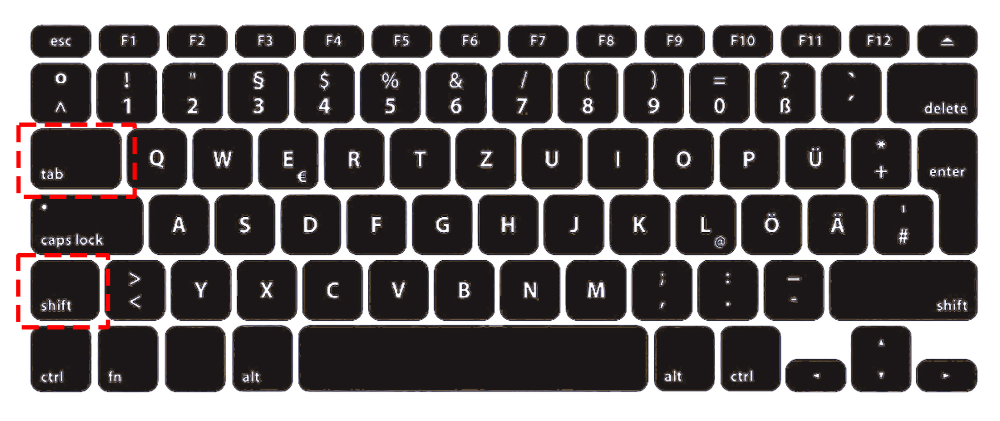

# Plan Mode

One of the things that makes Claude Code feel safe is that **you're always in control**. Claude asks before making changes, shows you what it's about to do, and never touches anything without your approval. But there's an even safer mode — **Plan mode** — that locks Claude into read-only so it can analyze and plan without any risk of changing a single file.

This lesson walks through the three modes Claude Code offers, and why Plan mode in particular is the secret weapon for learning and exploring without breaking anything.

## The three modes

Claude Code has three permission modes:

| Mode | What Claude can do | When to use it |
|------|--------------------|----------------|
| **Normal** (default) | Read, edit, and run commands — but asks for permission every time | Day-to-day work |
| **Auto-accept** | Read, edit, and run commands without asking | Only when you fully trust the task and want speed |
| **Plan mode** | **Read only.** Claude can analyze, think, and propose — but cannot change anything | Exploring, learning, high-stakes decisions |

Most people should start in **Normal** mode and stay there. The permission prompts become second nature after a few minutes, and they keep you in the loop.

## How to switch modes

You switch between modes with a single keyboard shortcut:

**Press `Shift + Tab`** to cycle through Normal → Auto-accept → Plan → Normal.

If you're not sure which keys those are, here they are on a standard keyboard — `Shift` on the left side, `Tab` just above it:



Hold `Shift` and tap `Tab` at the same time. Each press moves you to the next mode. You'll see the current mode indicated in the Claude Code interface so you always know where you are.

## Plan mode: the safe sandbox

Plan mode is special. When it's on, Claude **physically cannot modify your files or run commands**. It can only read. That sounds limiting, but it unlocks a very powerful way to work:

- **Ask Claude to analyze** your entire project without worrying that it might accidentally change something.
- **Let Claude propose a plan** — "how would you restructure these folders?" — and you get a full write-up without any actual changes.
- **Explore unfamiliar files** with zero risk. Claude can read and explain them to its heart's content.
- **Try a prompt you're not sure about** — if you're worried Claude might take a wrong turn and start editing things, Plan mode removes that risk entirely.

> **Plan mode is great for learning.** When you're new to Claude Code, put it in Plan mode and ask it to analyze your project. You get all the benefit of Claude's understanding with zero risk of anything going wrong. Once you see its plan, you can switch back to Normal mode and actually execute it.

## Auto-accept: use with caution

Auto-accept mode is the opposite of Plan mode — Claude makes changes without asking for permission. It's fast, but it's also the mode where people accidentally ship things they didn't intend.

**Only use Auto-accept when:**

- You've clearly scoped the task in your prompt
- You trust that Claude has enough context to do it right
- The changes are easily reversible (you're in version control, you have backups, etc.)
- You're doing a bunch of repetitive edits and the permission prompts are slowing you down

If any of those aren't true, stick with Normal mode.

## The mental model

Think of it as a dial:

```
Plan mode  ◄─── Normal ───►  Auto-accept
(safest)                     (fastest)
```

- Slide left when you want to **think and explore** without any risk.
- Stay in the middle for **normal work** — Claude acts, you approve.
- Slide right when you want **speed** and you've already done the thinking upfront.

Most people live in the middle. Smart people use Plan mode more than they think they should.

## Key takeaways

1. **Claude Code has three modes** — Normal, Auto-accept, and Plan.
2. **`Shift + Tab`** cycles between them.
3. **Plan mode is read-only** — Claude can analyze and propose but cannot change anything.
4. **Plan mode is perfect for learning** and for high-stakes decisions where you want a proposal before any action.
5. **Use Auto-accept sparingly** — only for tasks you've scoped well and can easily undo.
