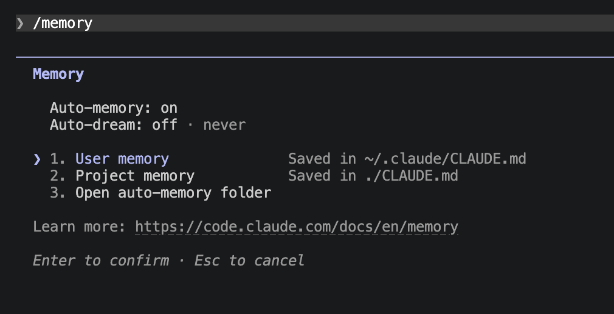
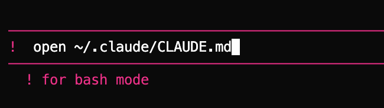
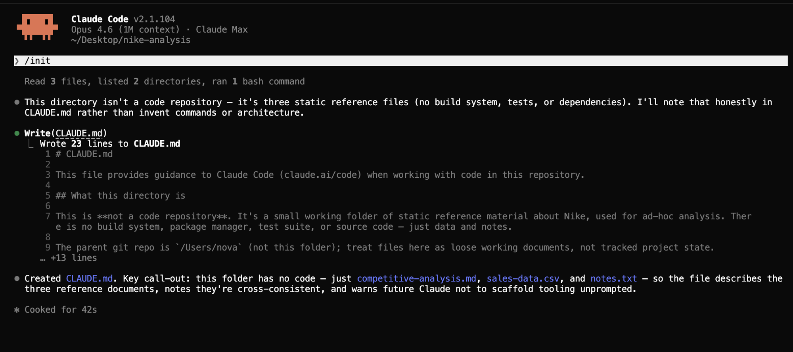
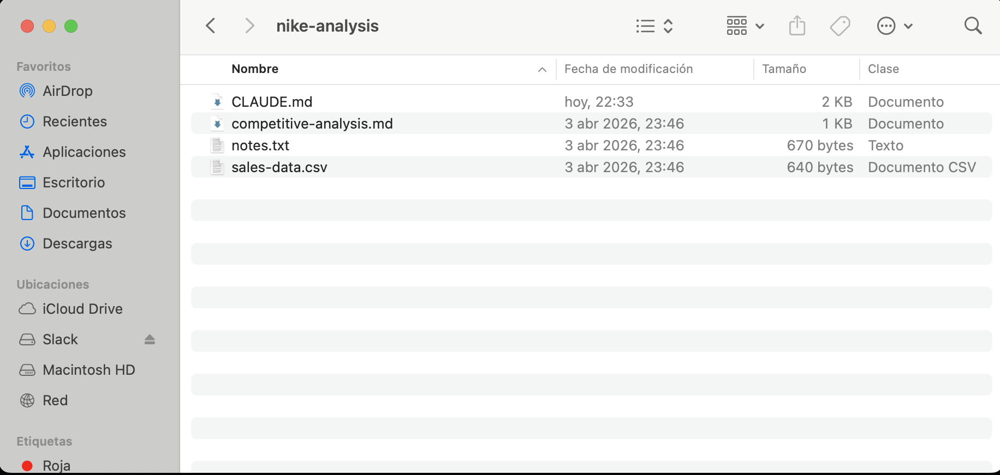

# Memory

**Brief Claude once — it remembers your project, your style, your lessons forever.**

Inés is a brand strategist in Barcelona with 4 clients. Every Monday she'd spend 18 minutes pasting the same context into Claude for each one — industry, competitors, tone of voice, last month's campaigns. Tuesday, same thing. 72 minutes a week re-introducing Claude to projects it had just helped her with the day before.

Until she discovered memory.

> Without memory, every conversation with Claude is a first date.

Memory is how you make context **permanent**. Every time you start a new conversation, Claude starts from zero — it doesn't know who you are, what you're working on, or how you like things done. With memory, Claude reads a simple text file at the beginning of **every** conversation with whatever you've told it about yourself and your project — automatically, always.

## Where Claude Code saves things

Before we dive into memory specifically, it's worth knowing where Claude Code keeps your stuff in general. Think of Claude Code like any other app on your computer (Word, Spotify, Chrome). It saves a few files on your machine so it can remember your stuff between sessions. There are three things worth knowing:

- **Your conversations** — saved right on your own computer, not in the cloud. If you close Claude today and come back tomorrow, your chat history is still there waiting for you.
- **Your global preferences and memory** — things that apply to *every* project you work on. These live in a hidden folder called `.claude` inside your user folder — the main folder on your Mac or PC that has your name on it. Your User memory (the one we're about to set up) lives here.
- **Your project-specific settings and memory** — rules that only apply to *this one* project. These live inside the project itself, so each project can have its own personality. Your Project memory lives here.

> **You don't have to create any of this.** Claude sets these folders up automatically the first time they're needed — you'll never have to make them by hand.

**What about privacy?** The only thing that ever leaves your computer is the message you type to Claude — exactly like when you chat with ChatGPT. Your files, your settings, your memory, and your conversation history all stay on your machine.

With that picture in mind, let's look at the two types of memory.

## Two types of memory

When you type `/memory` in Claude Code, you'll see a menu. Ignore the third item (*"Open auto-memory folder"*) for now — that's just a shortcut. The two that matter are **User memory** and **Project memory**:



### 1. User memory — about you

**Think of it as:** a sticky note Claude always carries with it, no matter which project you're working on. It's one file, saved inside your user folder — the main folder on your Mac or PC that has your name on it — and every project reads from it.

This follows you everywhere, across all projects. Put things here that are always true about you:

- Your role and what you do
- Your preferred language
- How you like responses formatted
- Things Claude should always do (or never do)

### 2. Project memory — about the project

**Think of it as:** a briefing document that lives inside one specific project folder. Only Claude reads it when you're working in that folder — in any other project, it's invisible.

This only applies to the current project. It stays with the folder. Put things here like:

- What the project is about
- Key files and what they contain
- Terminology and names
- Rules specific to this project

## What to put in memory

Most people only add the basics: their role and some preferences. But the ones who get the most value from Claude also add **lessons learned** — things they discovered that work or don't work:

```
I am a product manager at a B2B SaaS company for HR teams.
I prefer responses in Spanish, with bullet points.
Keep summaries under 200 words.

Lessons:
- Don't use tables for comparisons — the team prefers bullet lists.
- Always include an executive summary at the top of reports.
- When analyzing sales data, always compare year-over-year.
```

> **Think of it as training a new hire.** You wouldn't just tell them what the company does — you'd also tell them your preferences and mistakes to avoid. The better the briefing, the better they work from day one.

## Setting up your memory

Let's set up both types using the Nike project you've been working with.

### Step 1: Set up your User memory

In Claude Code, type the following command to open your personal memory file:

```
! open ~/.claude/CLAUDE.md
```



The `!` at the start is important — it tells Claude Code you want to run a shell command instead of chatting with Claude. You'll see the prompt turn pink and the label *"! for bash mode"* appear underneath, just like in the screenshot. Press Enter and the file opens in Cursor where you can edit it comfortably.

Yes, writing out something like this is boring — that's exactly what the [voice input](/en/lessons/voice-input) setup from the earlier lesson is for. Hit the voice shortcut and just *talk* your context out loud: who you are, what you work on, how you like things done, the quirks your team cares about. Ten seconds of talking beats two minutes of typing, and the result is usually richer because you're thinking out loud instead of editing as you go.

Here's a rough template of what to end up with:

```
I am a product manager.
I prefer responses in Spanish.
Keep summaries under 200 words.
Use bullet points instead of long paragraphs.
Always explain things in simple, non-technical language.
```

Save the file (`Cmd+S` on Mac, `Ctrl+S` on Windows) and you're done.

> **Note:** You can also use `/memory` and select "Edit User memory", but it opens a terminal editor (vim) which can be confusing. The `! open` command is simpler because it opens the file directly in Cursor.

### Step 2: Set up your Project memory

For project memory, the best practice is: **every time you start working in a new project folder, run `/init` as your first command.** Claude will scan your files, understand the project, and create a `CLAUDE.md` for you automatically.

1. Open Claude Code in your project folder
2. Type `/init`
3. Claude reads your files and generates a `CLAUDE.md` with the project context

Here's what it looks like when it runs — in this case on a `nike-analysis` folder:



Notice what's happening in that screenshot: Claude reads the files, writes a draft of `CLAUDE.md` in about 40 seconds, and even points out that this is a loose reference folder (not a real code repo) so it doesn't make up build systems or tooling that don't exist. It adapts to whatever kind of folder you're in.

When it finishes, a brand new `CLAUDE.md` shows up right inside your project folder — you can open Finder and see it sitting next to your other files:



That's your project memory. From now on, every time you open Claude Code in this folder, it reads that file first.

That's it. Claude figures out what the project is about, what the key files are, and writes the memory for you.

You can review and edit what Claude generated. Just open `CLAUDE.md` from the file explorer in Cursor (it will appear in the sidebar after Claude creates it).

For example, Claude might generate something like this for the Nike project:

```
This is a competitive analysis project for Nike.

Key files:
- competitive-analysis.md — the main report with strengths, weaknesses, opportunities, and threats
- sales-data.csv — quarterly revenue by region (North America, EMEA, Greater China, APLA)
- notes.txt — meeting notes from the brand strategy review on March 15

Important context:
- We are evaluating Nike's position against Adidas and New Balance
- The focus is on DTC strategy and digital transformation
- China recovery is a key concern for the team
```

Review it, tweak anything that's missing, save and you're done.

> **Make it a habit.** Every time you open a new project folder, run `/init` first. It takes 30 seconds and Claude starts every conversation already knowing what you're working on.

## Quick memory additions

You don't always need to open the memory file. During a conversation, you can add quick notes with `#`:

> `# When analyzing sales data, always compare year-over-year growth`

> `# Our fiscal year starts in June, not January`

Claude will add these to your project memory automatically.

## Tips for good memory

**Keep it concise.** Claude reads your entire memory file at the start of every conversation. **Keep it under 150-200 instructions** — beyond that, Claude starts ignoring rules. A focused, well-organized memory works much better than a long one.

**Update it regularly.** As your project evolves, update the memory. Remove things that are no longer true. Add new context as you learn it.

**Be specific.** Same rule as with voice — vagueness is the enemy:

| Good memory entries | Less useful entries |
|---|---|
| "Our Q4 deadline is March 30" | "We have a deadline" |
| "Compare all competitors against Nike as the baseline" | "Do good analysis" |
| "Revenue figures are in millions USD" | "Be careful with numbers" |

## How the two layers interact

When both memories are set up, Claude reads them both at the start of every conversation. If there's a conflict, **Project Memory wins over User Memory** for that project.

| Layer | Location | Scope | Example |
|-------|----------|-------|---------|
| **User Memory** | `~/.claude/CLAUDE.md` | All your projects | "I'm a PM, use bullet points" |
| **Project Memory** | `./CLAUDE.md` in the project root | Only this project | "Competitors are Adidas, New Balance..." |

For example: if your User Memory says "use EUR for currency" but the Project Memory says "use USD", Claude will use USD for that project.

## The learning loop

The biggest difference between good and great Claude Code users is the **learning loop**. After each project or session:

1. **Note what worked** — which prompts gave good results on the first try?
2. **Note what didn't** — where did Claude go in the wrong direction?
3. **Update your CLAUDE.md** — add the lessons so Claude doesn't repeat mistakes

```
Add to my project memory: "When creating reports, always
include an executive summary at the top. The team complained
last time when it was buried at the end."
```

Over time, your CLAUDE.md becomes a living document that makes Claude smarter with every project. The people who get the most value from Claude Code are the ones who iterate on their memory files — not the ones who write the best prompts.

## What memory is NOT

Memory is **not** a conversation history. Claude doesn't remember what you talked about yesterday. Memory is a set of instructions and context that Claude reads fresh every time.

Think of it like a briefing document you hand to a new team member on their first day — they haven't been in your meetings, but if the briefing is good, they can get up to speed quickly.
