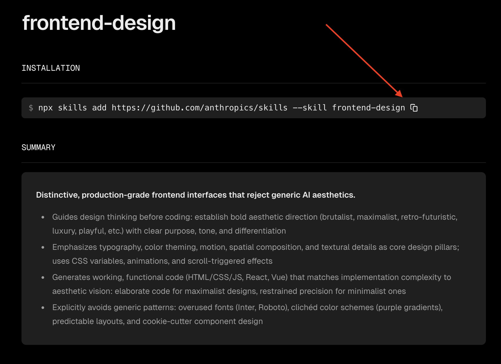
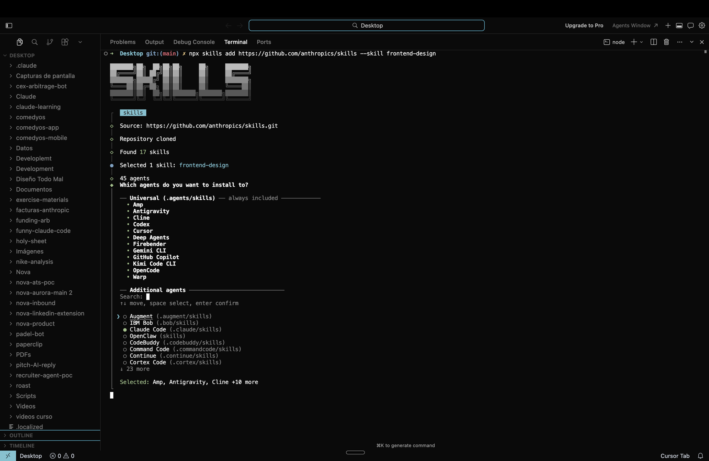
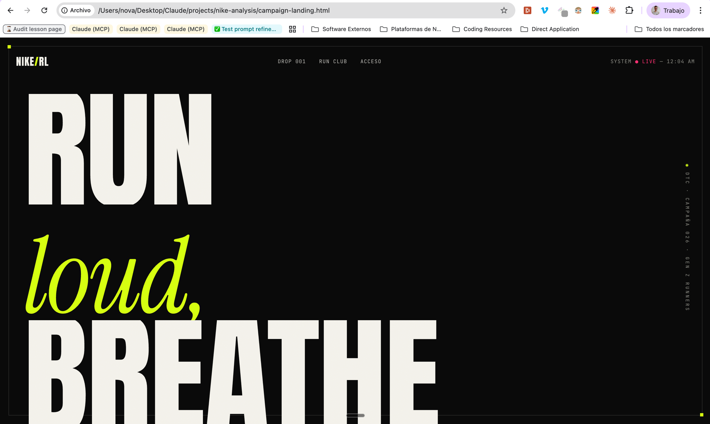

# Skills
**Teach Claude a workflow once — it runs it the same way, forever.**

Álvaro is a tech recruiter in Valencia. He writes ~30 outreach messages a week — each one to a different candidate for a different role, each one needing the same 4-paragraph structure: intro, role, why they're a fit, next step. Before building a Skill, he'd spend 8 minutes per message typing the scaffolding before he got to the part that actually mattered: *why this person for this role*.

**4 hours a week on scaffolding.**

Then he wrote it down once — the structure, the tone, the rules about what never to say — and saved it as a Skill. Now he pastes the candidate's profile and the role, Claude produces the scaffolded draft, and Álvaro spends his time on the part a human should: the pitch. Same output, same voice, a fraction of the time.

That's what Skills are. Memory remembers *who you are and what you're working on*. Skills remember *how you do things*.

> **Memory is who you are. Skills are what you know how to do.**

Think of a skill like a recipe card — you write down the steps once, and Claude follows them every time, producing consistent results.

| Benefit | Example |
|---------|---------|
| **Save time** | Stop re-typing "format my meeting notes like this" every session |
| **Stay consistent** | Every status report follows the same template |
| **Share with your team** | Everyone uses the same brand voice guidelines |
| **Claude activates them automatically** | Claude detects when a skill is relevant and uses it |

## Where your skills live

Skills follow the **same two-layer pattern** you already know from the [Memory lesson](/en/lessons/memory) — one layer for *you*, one for *each project*:

```
~/Desktop/Claude/                  ← your workspace (visible in Finder)
├── projects/
│   ├── nike-analysis/
│   │   ├── competitive-analysis.md
│   │   ├── sales-data.csv
│   │   ├── CLAUDE.md              ← project memory
│   │   └── .claude/
│   │       └── skills/            ← project-only skills (optional)
│   │           └── nike-report-style/
│   │               └── SKILL.md
│   └── q4-planning/
└── resources/

~/.claude/                         ← Claude Code's config (hidden)
├── CLAUDE.md                      ← your user memory
└── skills/                        ← your personal skills
    ├── meeting-notes/
    │   └── SKILL.md
    └── weekly-report-format/
        └── SKILL.md
```

Two things worth noticing:

- **Personal skills live at `~/.claude/skills/`** — the same hidden config folder where your user memory lives. Anything you drop here is available in **every project, every conversation**. This is where most of your skills will live: your formatting rules, your tone of voice, the workflows you repeat across clients.
- **Project skills live inside the project folder itself**, under `.claude/skills/`. Use this only for things that make sense for *one* project — a specific client's brand voice, a report template unique to that one account.

**Default to personal.** Most people end up with 10–20 personal skills and just a handful of project-specific ones. Only make a skill project-only if it genuinely doesn't apply anywhere else.

> **You don't have to create these folders by hand.** When you (or Claude) save your first skill, Claude Code creates the folder structure for you automatically — exactly like it did for your memory files.

## Explore the Skills Marketplace

Before creating your own skills, browse what's already available. The community has built hundreds of ready-to-use skills:

**[skills.sh](https://skills.sh/)**

It's like an app store for Claude Code capabilities — browse by category, see the most popular ones, and install with one command.

### Skills worth trying

Here are a few to get you started:

| Skill | What it does | Great for |
|-------|-------------|-----------|
| **frontend-design** | Creates polished web interfaces and landing pages | PMs wanting quick mockups |
| **pdf-generator** | Creates and fills PDF documents | Sales proposals, reports |
| **data-analyst** | Analyzes datasets, finds patterns, and creates visualizations | Sales ops, finance, anyone with CSVs |
| **simplify** | Reviews code for quality and simplifies it | Anyone reviewing Claude's output |

### How to install a skill

1. Go to [skills.sh](https://skills.sh/) and find a skill you like
2. Copy the install command (shown on the skill's page)

    

3. Paste it in your terminal (outside Claude Code, or prefix with `!` if you're inside)

    

4. It'll ask which agents to install it for — pick **Claude Code**. Your mouse won't work here — use the ↑↓ arrow keys to move, space to select, and Enter to confirm
5. When it asks about scope, choose **global** (so it's available across all your projects) and the **Symlink** method
6. Start a new Claude Code session — skills are loaded when the session starts, so any you install while Claude is already running won't appear until you restart

### Try it now

Install a skill from the marketplace and test it. For example, after installing **frontend-design**, you could ask Claude:

> `Create a simple landing page for a Nike DTC campaign targeting Gen Z runners`

Claude will use the skill's instructions to produce a polished result — much better than asking without the skill.

By the way, mine came out pretty slick 👇



## Creating Your Own Skills

Once you've seen what skills look like, you can create your own. Skills are simple text files stored in `.claude/skills/`.

### Ask Claude to create one

The easiest way:

```
Create a skill called "meeting-notes" that formats raw meeting notes into:
1. Meeting Summary (date, attendees)
2. Key Decisions
3. Action Items (task, owner, due date)
4. Open Questions
```

Claude will create the file for you in the right location — by default in `~/.claude/skills/` so it's available in every project. If you want it scoped to just one project instead, tell Claude that in your request (e.g. *"create it as a project skill"*).

### Using your skills

Once created, you can use a skill in three ways:

- **Type the slash command**: `/meeting-notes` and then paste your notes
- **Mention it in your prompt**: "Create a landing page for Nike's DTC campaign **using the frontend-design skill**" — this makes sure Claude uses the skill instead of doing it freestyle
- **Just ask naturally**: "Here are my meeting notes from today, please organize them" — Claude may recognize the request and activate the skill automatically

> **Important:** Claude doesn't always activate skills on its own. If you install a skill like **frontend-design** and just ask "create a landing page," Claude might do it without using the skill at all — and the result won't be as good. To be safe, **mention the skill in your prompt** or use the slash command.

### Make a skill always active for a project

If you want Claude to **always** use a specific skill in a project, add it to your project memory (`CLAUDE.md`). Open the file from Cursor or type in Claude Code:

```
! open CLAUDE.md
```

Add a line like:

```
When creating any frontend UI, always use the frontend-design skill.
When formatting meeting notes, always use the meeting-notes skill.
```

This way you don't have to remember to mention the skill every time — Claude will use it automatically for every conversation in that project.

## Real-world example: Sales Email skill

Here's a real skill used by a recruiting company's sales team. It standardizes how the team writes outreach emails — consistent tone, always data-driven, always with a soft close.

This is what the `SKILL.md` file looks like (shortened for clarity):

```markdown
# Sales Emails Skill

## How to Use
When you need to write a sales email:
1. Identify the email type from the catalogue below (ask if unclear)
2. Gather the required inputs for that type
3. Identify the language (match prior conversations; Spanish by default)
4. Draft the email following the structure and tone for that type

## Universal Tone Principles
1. **Warm and personal** — First person singular. Use the contact's first name.
   Reference the last conversation or shared context.
2. **Data-driven** — Always include specific numbers: hours saved, cost per
   process, total opportunity. Numbers build credibility.
3. **Structured for busy readers** — Lead with context, use bullet-point
   summaries, keep it scannable.
4. **Soft close, never pushy** — Propose a next step, don't demand one.
5. **Confident but not arrogant** — State what you can do clearly.
   Anchor claims in the client's data, not marketing language.

## Email Types

### Type 1: Business Case Follow-up
When: After presenting a business case. Goal: send a summary they can
circulate internally.

Required inputs:
- Contact name and company
- What was discussed/agreed
- Key numbers (hours saved, cost/hour, team size, total opportunity)
- Proposed pilot scope (typical: 10-20% of volume)

Structure:
Subject: Business Case [Company] x [Your Company]
- Greeting referencing the meeting
- Summary bullets with calculations (hours x cost = savings)
- Pilot proposal (collaborative framing)
- Soft CTA

### Type 2: Post-Meeting Follow-up
[...]

### Type 3: Pilot Proposal
[...]

### Type 4: Cold Intro
[...]

## Checklist
Before delivering any draft:
- Is the greeting warm and personal?
- Are all numbers specific and calculations shown?
- Is the CTA soft and clear (one next step)?
- Is it in the correct language?
- Does it sound personal, not like a template?
```

Notice what makes this skill effective:

- **Clear trigger** — tells Claude exactly when to activate
- **Universal principles** — tone rules that apply to every email type
- **Structured templates** — each email type has required inputs, structure, and guidelines
- **A checklist** — quality control before delivering the result
- **Language rules** — handles bilingual teams naturally

The sales team doesn't need to explain their email standards every time. They just say "write a follow-up email to Maria at Acme about the pilot" and Claude produces a draft that matches their voice, includes the right data, and follows their format.

## Tips

| Do | Avoid |
|----|-------|
| Browse the marketplace before building from scratch | Reinventing skills that already exist |
| Keep one skill focused on one task | Making a skill that tries to do everything |
| Include examples of expected output in your skill | Leaving Claude to guess the format |
| Share useful skills with your team | Keeping helpful workflows to yourself |

