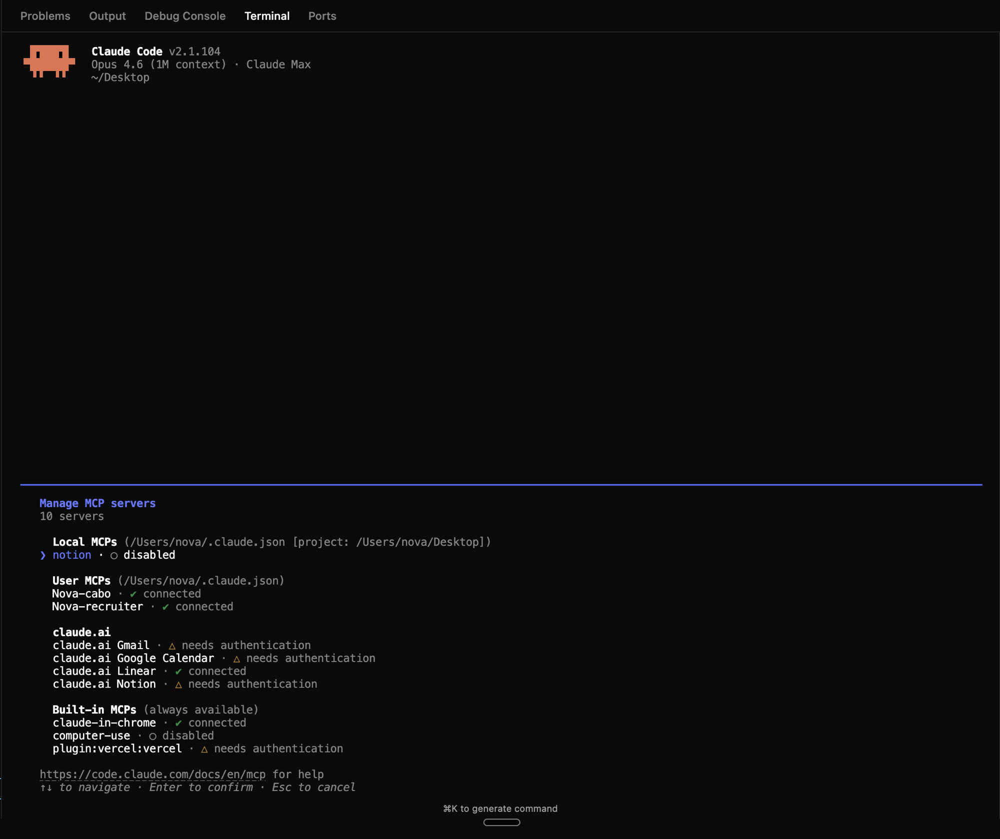
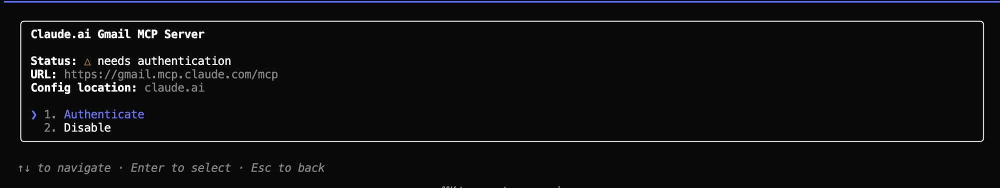
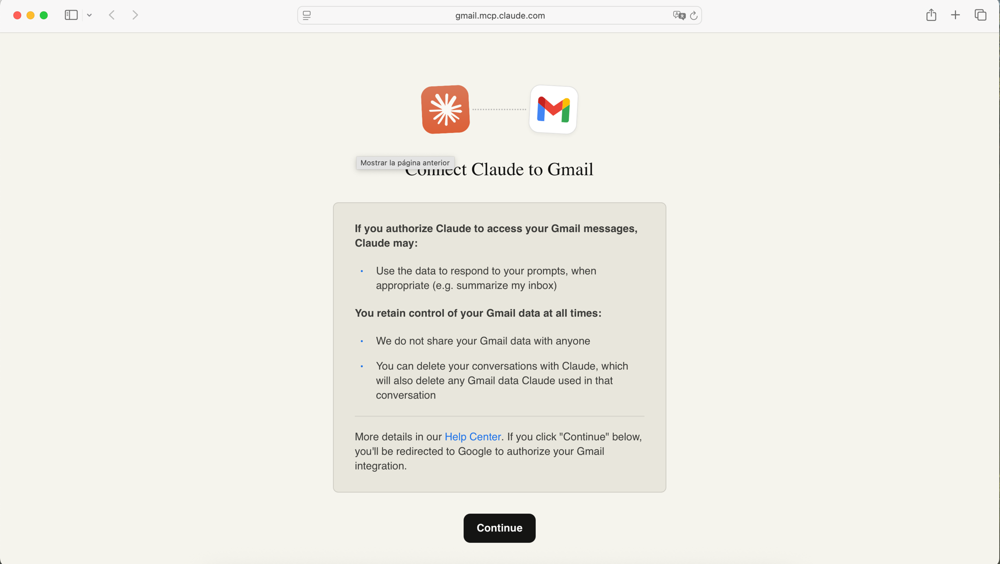
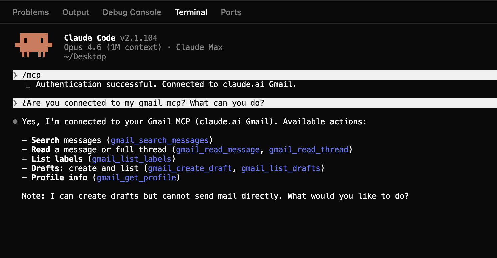

# MCP
**Dale a Claude acceso a Gmail, Notion, Slack y todas las herramientas donde ocurre tu trabajo real — con un solo comando.**

Laura dirige ventas en una startup B2B SaaS de Madrid. Una mañana le pidió a Claude: *"Redacta un follow-up para Carlos de Acme basándote en el hilo que tuvimos la semana pasada."* Claude respondió: *"No tengo acceso a tu Gmail."*

Durante dos semanas, Laura se pasó 35 minutos cada lunes pegando hilos de email en Claude a mano. Hasta que un compañero le enseñó un solo comando. Ahora, a las 8:30 de la mañana cada lunes, Claude ya le tiene redactados sus 4 follow-ups — haciendo referencia a lo último que dijo cada prospecto — antes de que Laura haya abierto Slack siquiera.

Ese comando instaló un **MCP**.

La memoria le da contexto a Claude. Los Skills le dan flujos de trabajo. Ambas cosas son potentes, pero ambas están limitadas a lo que ya vive en tu ordenador. ¿Necesitas un hilo de email de Gmail? ¿Una página de Notion? ¿Un mensaje de Slack? ¿Una fila de tu CRM? Claude no puede acceder a nada de eso por sí solo — solo ve tus archivos locales.

> **Sin MCP, Claude es brillante pero ciego al mundo exterior.**

MCP (Model Context Protocol) es cómo Claude Code se conecta a sistemas externos. Piensa en los servidores MCP como "adaptadores" — cada uno le da a Claude acceso a una herramienta o fuente de datos específica.

```
Tú  →  Claude Code  →  Servidor MCP  →  El mundo exterior
                       (el adaptador)
```

## El ecosistema MCP

Hay servidores MCP para la mayoría de las herramientas donde ocurre tu trabajo:

| Herramienta | Qué puede hacer Claude |
|------|-------------------|
| **Gmail** | Buscar emails, leer mensajes, redactar respuestas |
| **Slack** | Leer canales, enviar mensajes, buscar conversaciones |
| **Google Docs** | Leer y editar documentos |
| **Notion** | Navegar páginas, buscar en tu workspace |
| **Linear** | Rastrear issues, gestionar proyectos |
| **Fetch** | Leer cualquier página web |

Agregas cualquier servidor MCP con `claude mcp add`. Cada herramienta puede necesitar una API key o autenticación.

## Gestionar tus conexiones

| Comando | Qué hace |
|---------|----------|
| `claude mcp list` | Ver todos los servidores MCP conectados |
| `claude mcp remove fetch` | Desconectar un servidor |
| `/mcp` (dentro de Claude Code) | Navegar y gestionar conexiones interactivamente |

Cuando escribes `/mcp` dentro de Claude Code, verás una lista de tus servidores conectados y su estado — algo así:



Si seleccionas uno que necesita autenticación — Gmail, por ejemplo — se abre una vista de detalle donde puedes autenticarlo o desactivarlo:



La mayoría de MCPs que se conectan a herramientas externas (Gmail, Slack, Notion…) requieren autenticación. Cuando pulsas "Authenticate", Claude abre una pantalla de consentimiento en tu navegador para que des acceso — para Gmail es algo así:



Una vez conectado, ya puedes hablar con Claude y usará el MCP en tu nombre — buscar en tu bandeja de entrada, leer hilos, redactar respuestas, etc.:



## Importante: Los MCPs consumen tu ventana de contexto

Cada servidor MCP que tienes conectado ocupa espacio en la ventana de contexto de Claude — incluso si no lo estás usando. Claude necesita "conocer" las capacidades de cada servidor al inicio de cada conversación.

**Esto significa:**

- Si tienes 10 servidores MCP conectados pero solo usas 2, los otros 8 están desperdiciando espacio de contexto
- Menos espacio de contexto = Claude olvida cosas más rápido y produce peores resultados
- Más servidores MCP = inicio más lento en cada conversación

### Cómo gestionar esto

**Solo mantén conectados los MCPs que estés usando activamente.** Elimina el resto:

```bash
claude mcp list          # ver qué está conectado
claude mcp remove slack  # desconectar lo que no estés usando
```

Siempre puedes reconectarlos después cuando los necesites. Piensa en ello como pestañas del navegador — cierra las que no estés usando.

> **Regla general:** 2-3 servidores MCP conectados a la vez es lo ideal. Más de 5 y empezarás a notar respuestas más lentas y menos enfocadas de Claude.

## Consejos

- **Empieza por la herramienta donde más trabajas** — Gmail, Slack o Notion suelen ser el mayor desbloqueo
- **Agrega uno a la vez** — conecta un nuevo MCP, pruébalo, asegúrate de que funciona antes de agregar el siguiente
- **Desconecta cuando termines** — elimina MCPs que no estés usando activamente para ahorrar espacio de contexto
- **Revisa con `/mcp`** — escribe esto dentro de Claude Code para ver qué está conectado y si funciona

