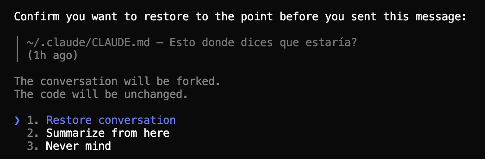

# Checkpoints
**The safety layer**

Memory gives Claude context, but it doesn't protect you from mistakes. You ask Claude to rewrite a section of your report and it goes in the wrong direction. Or you try an approach and realize it was a dead end. Without a way to go back, you're stuck cleaning up the mess.

> **Checkpoints let you experiment without fear. Try anything — if it doesn't work, rewind.**

Every time you send a message to Claude, it automatically saves a checkpoint — a snapshot of your conversation and files at that moment. Think of it like an unlimited "undo" button. You can rewind to any previous point and start again from there.

## How to rewind

Press **Esc twice** (`Esc + Esc`) — or type `/rewind` — to open the rewind menu. You'll see a scrollable list of every message you sent in the session. Pick the point you want to go back to.

What happens next depends on whether Claude has edited any of your files since that point.

### The usual case: rewinding the conversation

If you've been mostly chatting with Claude — asking questions, brainstorming, reviewing files without editing them — you'll see three options when you pick a message to rewind to:

1. **Restore conversation** — jump the chat back to that point. Everything you and Claude said after it is dropped, and you start fresh from that moment.
2. **Summarize from here** — instead of throwing the later messages away, Claude squeezes them into a compact summary and carries on with that summary as the new context. Good for freeing up space in the conversation without losing the gist of what happened.
3. **Never mind** — cancel and go back to the message list.

A nice detail: after you pick **Restore conversation** or **Summarize from here**, the original text of the selected message is put back into your input field — so you can resend it as-is or edit it first.

### When Claude has edited your files: two more options

The moment Claude has actually edited files in your project — a report, a spreadsheet, a doc, some notes — the menu grows to **five options**. The new ones let you also undo the file changes, not just the conversation:

1. **Restore code and conversation** — revert *both* your files and the conversation to that point. The closest thing to a full "undo". (The word "code" in the button is just the technical name Claude Code uses — for you it means "your files": reports, CSVs, notes, whatever Claude touched.)
2. **Restore conversation** — same as before: rewind the chat but keep your current files.
3. **Restore code** — revert the files but keep the conversation. Useful when you want Claude to try a different edit but you don't want to re-explain the context.
4. **Summarize from here** — same as before. Your files stay unchanged.
5. **Never mind** — same as before.

When Claude has been editing files for you, **Restore code and conversation** is usually what you want — a clean, full rewind back to a state where everything was fine.

## What checkpoints don't cover

Checkpoints are a great safety net, but they're not magic. A few things they *don't* track:

- **Files modified through terminal commands.** If Claude runs something like `rm file.txt` or `mv old.txt new.txt` from the terminal, those changes are **not** checkpointed and can't be undone by rewind. Only edits that Claude makes directly to files are tracked.
- **Files you edit yourself** outside of Claude Code.
- **Changes from other Claude Code sessions** running at the same time.

For these cases, rely on your normal safety nets — regular backups (Time Machine, iCloud, Dropbox) and, if you're in a git-based project, your commit history. Think of checkpoints as a **session-level undo button**, not as permanent history.

## Things to know

- **Checkpoints are automatic** — you don't need to create them manually
- **They're created on every message** — so you can rewind to any point in your conversation
- **They last 30 days** — old checkpoints are cleaned up automatically
- **Press Esc + Esc** — that's all you need to remember

> **The key idea:** Checkpoints let you experiment without fear. Try things, and if they don't work, rewind. It's that simple.

