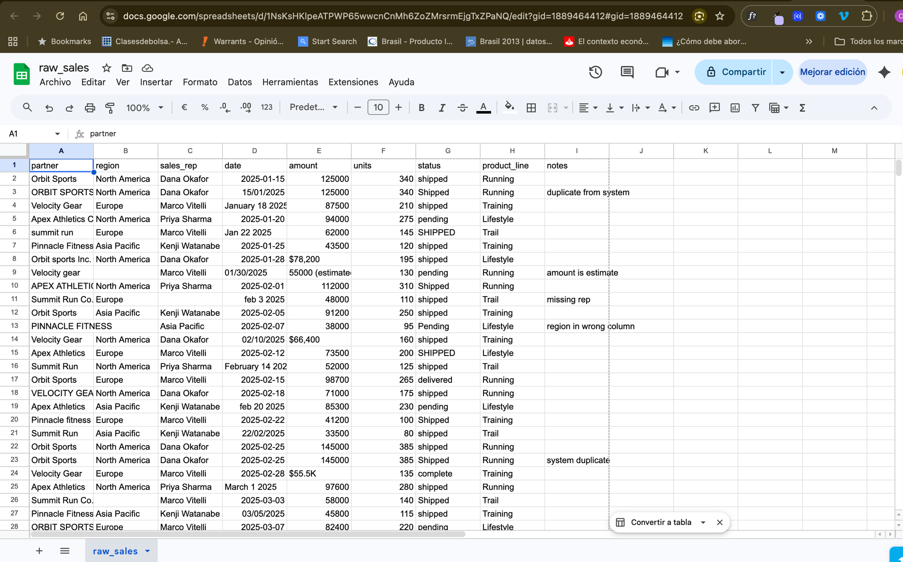
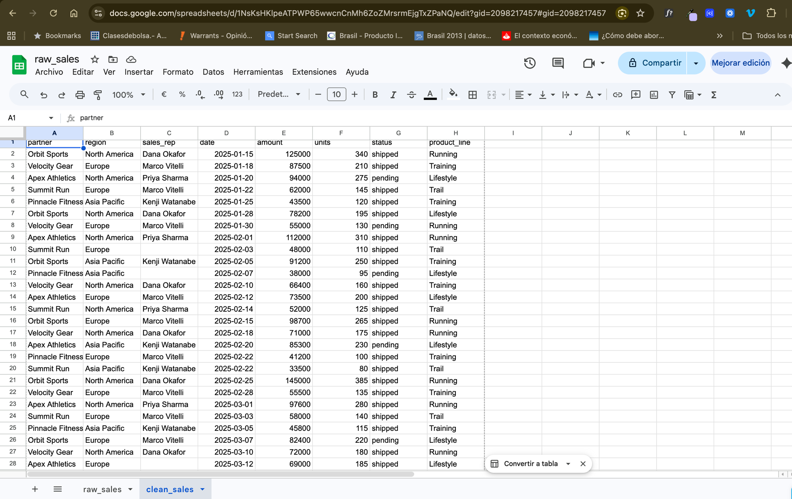

# Ejercicio 2: Domina una hoja de cálculo desordenada

**Tiempo:** 30 minutos | **Nivel:** Principiante
**Módulo:** [03-skills](../../03-skills/) -- Crear skills reutilizables
**Habilidad:** Construir un skill reutilizable que automatice la limpieza de CSVs

## Objetivo

Aprenderás a crear un **skill reutilizable de Claude Code** resolviendo primero un problema real (limpiar un CSV desordenado) y luego empaquetando tu solución para que funcione automáticamente cada vez que te encuentres con un desorden similar.

Al finalizar, entenderás:
- Cómo analizar y limpiar datos desordenados con Claude Code
- Cómo convertir un flujo de trabajo puntual en un skill reutilizable
- La estructura de un archivo SKILL.md
- Cómo los skills se activan automáticamente según palabras clave

## Escenario

Estás trabajando en el proyecto de análisis competitivo de Nike. Un colega del equipo de ventas acaba de compartir una hoja de cálculo con datos de ventas de socios minoristas del Q1. El problema: los datos son un desastre. Los nombres son inconsistentes, las fechas están en todos los formatos posibles, hay duplicados y algunas entradas mezclan notas donde deberían ir números.

Tu tarea: limpiarlo y luego construir un skill para que la próxima hoja desordenada tome segundos en vez de una hora.

## Lo que tienes

Un archivo CSV en `data/raw_sales.csv` con ~40 filas de datos de ventas de socios minoristas. Los problemas incluyen:

- **Nombres de empresas inconsistentes** ("Orbit Sports", "ORBIT SPORTS", "Orbit sports Inc.")
- **Formatos de fecha mezclados** ("15/01/2025", "2025-01-15", "January 15", "Jan 15 2025")
- **Filas duplicadas** (mismo socio, misma fecha, mismo monto)
- **Valores de estado inconsistentes** ("shipped", "Shipped", "SHIPPED", "delivered", "complete")
- **Campos faltantes** (regiones en blanco, representantes de ventas ausentes)
- **Notas mezcladas en campos numéricos** ("12500 (estimated)", "$8,200 USD")
- **Formato de moneda inconsistente** ("$12,500", "12500", "$12.5K")

## Preparación

> **Este es el mismo flujo de trabajo que usarás en proyectos reales.** Crea un proyecto, copia tus datos, y trabaja desde ahí.

**Descarga los archivos del curso** (solo la primera vez):

```bash
git clone https://github.com/cristiangarcia-eng/claude-learning.git ~/Desktop/claude-learning
```

**Crea tu proyecto:**

```bash
mkdir -p ~/Desktop/Claude/projects/messy-spreadsheet/data
mkdir ~/Desktop/Claude/projects/messy-spreadsheet/output
```

**Copia los datos del ejercicio:**

```bash
cp ~/Desktop/claude-learning/11-exercises/02-messy-spreadsheet/data/raw_sales.csv ~/Desktop/Claude/projects/messy-spreadsheet/data/
```

**Abre el proyecto:**

```bash
cd ~/Desktop/Claude/projects/messy-spreadsheet
```

Inicia Claude Code aquí (`claude`). Tu proyecto se ve así:

```
messy-spreadsheet/
├── data/
│   └── raw_sales.csv
└── output/          ← Claude guarda los resultados aquí
```

## Instrucciones paso a paso

### Paso 1: Explora el desorden (5 minutos)

Abre Claude Code en la carpeta de tu proyecto y pregunta:

```
Read data/raw_sales.csv and give me a full diagnosis. How many issues
do you find? Categorize them by type (duplicates, formatting, missing
data, inconsistencies). Show me specific examples of each problem.
```

Revisa el diagnóstico. Entender los problemas es la mitad del trabajo.

**Quieres ver el desorden con tus propios ojos?** Abre `data/raw_sales.csv` en Excel o Google Sheets. Verás algo así:



### Paso 2: Limpia los datos (10 minutos)

Pídele a Claude Code que arregle todo:

```
Clean up data/raw_sales.csv and save the result as output/clean_sales.csv.
Apply these rules:

1. Standardize company names to their canonical form:
   - "Orbit Sports" (not "ORBIT SPORTS" or "Orbit sports Inc.")
   - "Velocity Gear" (not "Velocity gear" or "VELOCITY GEAR LLC")
   - "Apex Athletics" (not "APEX ATHLETICS" or "Apex Athletics Corp")
   - "Summit Run" (not "summit run" or "Summit Run Co.")
   - "Pinnacle Fitness" (not "PINNACLE FITNESS" or "Pinnacle fitness")

2. Standardize all dates to YYYY-MM-DD format

3. Remove duplicate rows (same partner + same date + same amount)

4. Standardize status to lowercase: shipped, pending, cancelled, returned

5. Clean amount fields: remove dollar signs, commas, "K" notation,
   and notes in parentheses. All amounts should be plain numbers.

6. Fill missing regions based on the partner's other entries

7. Generate a cleanup report showing what changed (how many fixes
   per category)

Save the clean file as output/clean_sales.csv
```

Revisa el resultado. Abre `output/clean_sales.csv` en Excel o Google Sheets para verificar que se vea bien. Compáralo con el original -- la diferencia debería ser dramática:



### Paso 3: Construye el skill (10 minutos)

Ahora conviértelo en un skill reutilizable. Pídele a Claude Code:

```
Help me create a skill that automates CSV cleanup. Create the skill
at .claude/skills/clean-csv/SKILL.md with this structure:

The skill should:
- Auto-trigger when I say "clean this CSV", "fix this spreadsheet",
  "standardize this data", or "tidy up this file"
- Accept any CSV file, not just this specific one
- Follow the same cleanup rules: standardize names to title case,
  fix dates to YYYY-MM-DD, remove duplicates, normalize status fields,
  clean number formatting, fill gaps where possible
- Always output a cleanup report showing what changed
- Save the clean file in the output/ folder with a _clean suffix (e.g., output/raw_sales_clean.csv)

Use the SKILL.md format from the 03-skills module.
```

### Paso 4: Prueba el skill (5 minutos)

Inicia una conversación nueva (`/clear`) y prueba con lenguaje natural:

```
Can you clean up data/raw_sales.csv? It is pretty messy.
```

El skill debería activarse automáticamente y aplicar el mismo proceso de limpieza sin que tengas que repetir todas las reglas.

## Conexión con el Módulo 03 (Skills)

| Concepto de Skill | Cómo lo usas aquí |
|-------------------|-------------------|
| **Formato SKILL.md** | Creas el archivo de definición del skill |
| **Activación automática** | Palabras clave como "clean" y "standardize" lo activan |
| **Reutilización** | Funciona con cualquier CSV, no solo con este |
| **Reporte de limpieza** | Salida consistente que muestra lo que hizo el skill |

## Criterios de éxito

- [ ] `output/clean_sales.csv` existe con datos estandarizados y sin duplicados
- [ ] `.claude/skills/clean-csv/SKILL.md` existe con la estructura correcta
- [ ] El skill se activa automáticamente cuando pides "limpiar" o "estandarizar" un CSV
- [ ] El skill funciona con cualquier CSV desordenado, no solo con los datos de ventas
- [ ] Se genera un reporte de limpieza mostrando los cambios realizados

## Lo que aprendiste

La verdadera habilidad no es limpiar una hoja de cálculo -- es reconocer que **cualquier flujo de trabajo repetitivo puede convertirse en un skill**. La próxima vez que un colega envíe datos desordenados, tu skill lo resuelve en segundos. Busca patrones en tu trabajo: si le has explicado el mismo proceso a Claude Code más de dos veces, debería ser un skill.
