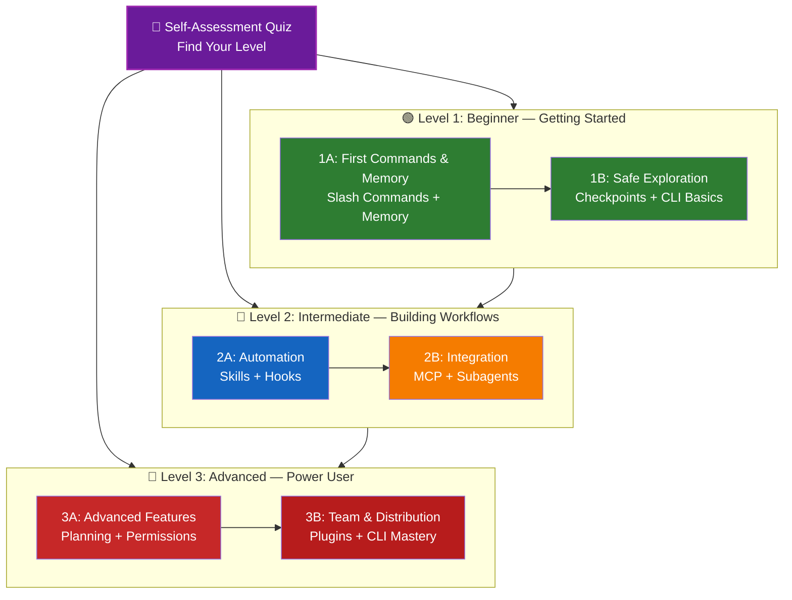

<picture>
  <source media="(prefers-color-scheme: dark)" srcset="resources/logos/claude-howto-logo-dark.svg">
  
</picture>

# 📚 Hoja de Ruta de Aprendizaje de Claude Code

**¿Eres nuevo en Claude Code?** Esta guía te ayuda a dominar las funcionalidades de Claude Code a tu propio ritmo. Ya seas un principiante absoluto o un desarrollador con experiencia, comienza con el cuestionario de autoevaluación a continuación para encontrar el camino adecuado para ti.

---

## 🧭 Encuentra Tu Nivel

No todos empiezan desde el mismo punto. Realiza está autoevaluación rápida para encontrar el punto de entrada correcto.

**Responde estas preguntas con honestidad:**

- [ ] Puedo iniciar Claude Code y tener una conversación (`claude`)
- [ ] He creado o editado un archivo CLAUDE.md
- [ ] He usado al menos 3 comandos slash integrados (p. ej., /help, /compact, /model)
- [ ] He creado un comando slash personalizado o skill (SKILL.md)
- [ ] He configurado un servidor MCP (p. ej., GitHub, base de datos)
- [ ] He configurado hooks en ~/.claude/settings.json
- [ ] He creado o usado subagentes personalizados (.claude/agents/)
- [ ] He usado el modo print (`claude -p`) para scripting o CI/CD

**Tu Nivel:**

| Respuestas | Nivel | Comienza En | Tiempo para Completar |
|------------|-------|-------------|----------------------|
| 0-2 | **Nivel 1: Principiante** — Primeros Pasos | [Hito 1A](#milestone-1a-first-commands--memory) | ~3 horas |
| 3-5 | **Nivel 2: Intermedio** — Construyendo Flujos de Trabajo | [Hito 2A](#milestone-2a-automation-skills--hooks) | ~5 horas |
| 6-8 | **Nivel 3: Avanzado** — Usuario Experto y Líder de Equipo | [Hito 3A](#milestone-3a-advanced-features) | ~5 horas |

> **Consejo**: Si no estás seguro, empieza un nivel más abajo. Es mejor repasar material conocido rápidamente que perderse conceptos fundamentales.

> **Versión interactiva**: Ejecuta `/self-assessment` en Claude Code para obtener un cuestionario guiado e interactivo que evalúa tu competencia en las 10 áreas de funcionalidades y genera una ruta de aprendizaje personalizada.

---

## 🎯 Filosofía de Aprendizaje

Las carpetas en este repositorio están numeradas en el **orden de aprendizaje recomendado**, basado en tres principios clave:

1. **Dependencias** — Los conceptos fundamentales van primero
2. **Complejidad** — Las funcionalidades más sencillas antes que las avanzadas
3. **Frecuencia de Uso** — Las funcionalidades más comunes se enseñan primero

Este enfoque asegura que construyas una base sólida mientras obtienes beneficios inmediatos de productividad.

---

## 🗺️ Tu Ruta de Aprendizaje



**Leyenda de Colores:**
- 💜 Morado: Cuestionario de Autoevaluación
- 🟢 Verde: Nivel 1 — Ruta para principiantes
- 🔵 Azul / 🟡 Dorado: Nivel 2 — Ruta intermedia
- 🔴 Rojo: Nivel 3 — Ruta avanzada

---

## 📊 Tabla Completa de la Hoja de Ruta

| Paso | Funcionalidad | Complejidad | Tiempo | Nivel | Dependencias | Por Qué Aprenderlo | Beneficios Clave |
|------|--------------|-------------|--------|-------|--------------|-------------------|-----------------|
| **1** | [Slash Commands](01-slash-commands/) | ⭐ Principiante | 30 min | Nivel 1 | Ninguna | Ganancias rápidas de productividad (55+ integrados + 5 skills incluidos) | Automatización instantánea, estándares de equipo |
| **2** | [Memory](02-memory/) | ⭐⭐ Principiante+ | 45 min | Nivel 1 | Ninguna | Esencial para todas las funcionalidades | Contexto persistente, preferencias |
| **3** | [Checkpoints](08-checkpoints/) | ⭐⭐ Intermedio | 45 min | Nivel 1 | Gestión de sesiones | Exploración segura | Experimentación, recuperación |
| **4** | [CLI Basics](10-cli/) | ⭐⭐ Principiante+ | 30 min | Nivel 1 | Ninguna | Uso básico del CLI | Modo interactivo y print |
| **5** | [Skills](03-skills/) | ⭐⭐ Intermedio | 1 hora | Nivel 2 | Slash Commands | Experiencia automática | Capacidades reutilizables, consistencia |
| **6** | [Hooks](06-hooks/) | ⭐⭐ Intermedio | 1 hora | Nivel 2 | Herramientas, Comandos | Automatización de flujos de trabajo (25 eventos, 4 tipos) | Validación, controles de calidad |
| **7** | [MCP](05-mcp/) | ⭐⭐⭐ Intermedio+ | 1 hora | Nivel 2 | Configuración | Acceso a datos en vivo | Integración en tiempo real, APIs |
| **8** | [Subagents](04-subagents/) | ⭐⭐⭐ Intermedio+ | 1.5 horas | Nivel 2 | Memory, Commands | Manejo de tareas complejas (6 integrados incluyendo Bash) | Delegación, experiencia especializada |
| **9** | [Advanced Features](09-advanced-features/) | ⭐⭐⭐⭐⭐ Avanzado | 2-3 horas | Nivel 3 | Todos los anteriores | Herramientas para usuarios expertos | Planificación, Modo Auto, Canales, Dictado por Voz, permisos |
| **10** | [Plugins](07-plugins/) | ⭐⭐⭐⭐ Avanzado | 2 horas | Nivel 3 | Todos los anteriores | Soluciones completas | Incorporación de equipos, distribución |
| **11** | [CLI Mastery](10-cli/) | ⭐⭐⭐ Avanzado | 1 hora | Nivel 3 | Recomendado: Todos | Dominar el uso de línea de comandos | Scripting, CI/CD, automatización |

**Tiempo Total de Aprendizaje**: ~11-13 horas (o salta a tu nivel y ahorra tiempo)

---

## 🟢 Nivel 1: Principiante — Primeros Pasos

**Para**: Usuarios con 0-2 respuestas en el cuestionario
**Tiempo**: ~3 horas
**Enfoque**: Productividad inmediata, comprensión de los fundamentos
**Resultado**: Usuario cómodo en el día a día, listo para el Nivel 2

> **Antes de comenzar**: Asegúrate de haber completado los módulos fundamentales (serie 00). En particular, si nunca has usado Git, completa [Git Basics](00g-git-basics/) primero — Claude Code usa conceptos de Git como commits, ramas y diffs a lo largo del curso.

### Hito 1A: Primeros Comandos y Memoria

**Temas**: Slash Commands + Memory
**Tiempo**: 1-2 horas
**Complejidad**: ⭐ Principiante
**Objetivo**: Impulso inmediato de productividad con comandos personalizados y contexto persistente

#### Qué Lograrás
✅ Crear comandos slash personalizados para tareas repetitivas
✅ Configurar la memoria del proyecto para los estándares del equipo
✅ Configurar preferencias personales
✅ Entender cómo Claude carga el contexto automáticamente

#### Ejercicios Prácticos

```bash
# Ejercicio 1: Instala tu primer slash command
mkdir -p .claude/commands
cp 01-slash-commands/optimize.md .claude/commands/

# Ejercicio 2: Crea la memoria del proyecto
cp 02-memory/project-CLAUDE.md ./CLAUDE.md

# Ejercicio 3: Pruébalo
# En Claude Code, escribe: /optimize
```

#### Criterios de Éxito
- [ ] Invocas exitosamente el comando `/optimize`
- [ ] Claude recuerda los estándares de tu proyecto desde CLAUDE.md
- [ ] Entiendes cuándo usar slash commands vs. memoria

#### Próximos Pasos
Una vez que te sientas cómodo, lee:
- [01-slash-commands/README.es.md](01-slash-commands/README.es.md)
- [02-memory/README.es.md](02-memory/README.es.md)

> **Verifica tu comprensión**: Ejecuta `/lesson-quiz slash-commands` o `/lesson-quiz memory` en Claude Code para poner a prueba lo que has aprendido.

---

### Hito 1B: Exploración Segura

**Temas**: Checkpoints + CLI Basics
**Tiempo**: 1 hora
**Complejidad**: ⭐⭐ Principiante+
**Objetivo**: Aprender a experimentar con seguridad y usar los comandos CLI básicos

#### Qué Lograrás
✅ Crear y restaurar checkpoints para experimentar con seguridad
✅ Entender el modo interactivo vs. el modo print
✅ Usar flags y opciones básicas del CLI
✅ Procesar archivos mediante piping

#### Ejercicios Prácticos

```bash
# Ejercicio 1: Prueba el flujo de trabajo con checkpoints
# En Claude Code:
# Haz algunos cambios experimentales, luego presiona Esc+Esc o usa /rewind
# Selecciona el checkpoint anterior a tu experimento
# Elige "Restore code and conversation" para volver atrás

# Ejercicio 2: Modo interactivo vs. modo print
claude "explain this project"           # Modo interactivo
claude -p "explain this function"       # Modo print (no interactivo)

# Ejercicio 3: Procesa el contenido de un archivo mediante piping
cat error.log | claude -p "explain this error"
```

#### Criterios de Éxito
- [ ] Creaste y revertiste a un checkpoint
- [ ] Usaste tanto el modo interactivo como el modo print
- [ ] Enviaste un archivo a Claude mediante piping para análisis
- [ ] Entiendes cuándo usar checkpoints para experimentar con seguridad

#### Próximos Pasos
- Leer: [08-checkpoints/README.es.md](08-checkpoints/README.es.md)
- Leer: [10-cli/README.es.md](10-cli/README.es.md)
- **¡Listo para el Nivel 2!** Continúa con el [Hito 2A](#milestone-2a-automation-skills--hooks)

> **Verifica tu comprensión**: Ejecuta `/lesson-quiz checkpoints` o `/lesson-quiz cli` para confirmar que estás listo para el Nivel 2.

---

## 🔵 Nivel 2: Intermedio — Construyendo Flujos de Trabajo

**Para**: Usuarios con 3-5 respuestas en el cuestionario
**Tiempo**: ~5 horas
**Enfoque**: Automatización, integración, delegación de tareas
**Resultado**: Flujos de trabajo automatizados, integraciones externas, listo para el Nivel 3

### Verificación de Prerrequisitos

Antes de comenzar el Nivel 2, asegúrate de sentirte cómodo con estos conceptos del Nivel 1:

- [ ] Puedes crear y usar slash commands ([01-slash-commands/](01-slash-commands/))
- [ ] Has configurado la memoria del proyecto mediante CLAUDE.md ([02-memory/](02-memory/))
- [ ] Sabes cómo crear y restaurar checkpoints ([08-checkpoints/](08-checkpoints/))
- [ ] Puedes usar `claude` y `claude -p` desde la línea de comandos ([10-cli/](10-cli/))

> **¿Tienes lagunas?** Repasa los tutoriales enlazados arriba antes de continuar.

---

### Hito 2A: Automatización (Skills + Hooks)

**Temas**: Skills + Hooks
**Tiempo**: 2-3 horas
**Complejidad**: ⭐⭐ Intermedio
**Objetivo**: Automatizar flujos de trabajo comunes y verificaciones de calidad

#### Qué Lograrás
✅ Invocar automáticamente capacidades especializadas con frontmatter YAML (incluidos los campos `effort` y `shell`)
✅ Configurar automatización basada en eventos en 25 eventos de hooks
✅ Usar los 4 tipos de hooks (command, http, prompt, agent)
✅ Aplicar estándares de calidad de código
✅ Crear hooks personalizados para tu flujo de trabajo

#### Ejercicios Prácticos

```bash
# Ejercicio 1: Instala un skill
cp -r 03-skills/code-review ~/.claude/skills/

# Ejercicio 2: Configura hooks
mkdir -p ~/.claude/hooks
cp 06-hooks/pre-tool-check.sh ~/.claude/hooks/
chmod +x ~/.claude/hooks/pre-tool-check.sh

# Ejercicio 3: Configura los hooks en settings
# Agrega a ~/.claude/settings.json:
{
  "hooks": {
    "PreToolUse": [
      {
        "matcher": "Bash",
        "hooks": [
          {
            "type": "command",
            "command": "~/.claude/hooks/pre-tool-check.sh"
          }
        ]
      }
    ]
  }
}
```

#### Criterios de Éxito
- [ ] El skill de revisión de código se invoca automáticamente cuando es relevante
- [ ] El hook PreToolUse se ejecuta antes de la ejecución de herramientas
- [ ] Entiendes la diferencia entre la auto-invocación de skills y los disparadores de eventos de hooks

#### Próximos Pasos
- Crea tu propio skill personalizado
- Configura hooks adicionales para tu flujo de trabajo
- Leer: [03-skills/README.es.md](03-skills/README.es.md)
- Leer: [06-hooks/README.es.md](06-hooks/README.es.md)

> **Verifica tu comprensión**: Ejecuta `/lesson-quiz skills` o `/lesson-quiz hooks` para poner a prueba tus conocimientos antes de continuar.

---

### Hito 2B: Integración (MCP + Subagentes)

**Temas**: MCP + Subagents
**Tiempo**: 2-3 horas
**Complejidad**: ⭐⭐⭐ Intermedio+
**Objetivo**: Integrar servicios externos y delegar tareas complejas

#### Qué Lograrás
✅ Acceder a datos en vivo de GitHub, bases de datos, etc.
✅ Delegar trabajo a agentes de IA especializados
✅ Entender cuándo usar MCP vs. subagentes
✅ Construir flujos de trabajo integrados

#### Ejercicios Prácticos

```bash
# Ejercicio 1: Configura GitHub MCP
export GITHUB_TOKEN="your_github_token"
claude mcp add github -- npx -y @modelcontextprotocol/server-github

# Ejercicio 2: Prueba la integración MCP
# En Claude Code: /mcp__github__list_prs

# Ejercicio 3: Instala subagentes
mkdir -p .claude/agents
cp 04-subagents/*.md .claude/agents/
```

#### Ejercicio de Integración
Prueba este flujo de trabajo completo:
1. Usa MCP para obtener un PR de GitHub
2. Deja que Claude delegue la revisión al subagente code-reviewer
3. Usa hooks para ejecutar pruebas automáticamente

#### Criterios de Éxito
- [ ] Consultas exitosamente datos de GitHub mediante MCP
- [ ] Claude delega tareas complejas a subagentes
- [ ] Entiendes la diferencia entre MCP y subagentes
- [ ] Combinaste MCP + subagentes + hooks en un flujo de trabajo

#### Próximos Pasos
- Configura servidores MCP adicionales (base de datos, Slack, etc.)
- Crea subagentes personalizados para tu dominio
- Leer: [05-mcp/README.es.md](05-mcp/README.es.md)
- Leer: [04-subagents/README.es.md](04-subagents/README.es.md)
- **¡Listo para el Nivel 3!** Continúa con el [Hito 3A](#milestone-3a-advanced-features)

> **Verifica tu comprensión**: Ejecuta `/lesson-quiz mcp` o `/lesson-quiz subagents` para confirmar que estás listo para el Nivel 3.

---

## 🔴 Nivel 3: Avanzado — Usuario Experto y Líder de Equipo

**Para**: Usuarios con 6-8 respuestas en el cuestionario
**Tiempo**: ~5 horas
**Enfoque**: Herramientas de equipo, CI/CD, funcionalidades empresariales, desarrollo de plugins
**Resultado**: Usuario experto, capaz de configurar flujos de trabajo en equipo y CI/CD

### Verificación de Prerrequisitos

Antes de comenzar el Nivel 3, asegúrate de sentirte cómodo con estos conceptos del Nivel 2:

- [ ] Puedes crear y usar skills con auto-invocación ([03-skills/](03-skills/))
- [ ] Has configurado hooks para automatización basada en eventos ([06-hooks/](06-hooks/))
- [ ] Puedes configurar servidores MCP para datos externos ([05-mcp/](05-mcp/))
- [ ] Sabes cómo usar subagentes para delegación de tareas ([04-subagents/](04-subagents/))

> **¿Tienes lagunas?** Repasa los tutoriales enlazados arriba antes de continuar.

---

### Hito 3A: Funcionalidades Avanzadas

**Temas**: Funcionalidades Avanzadas (Planificación, Permisos, Pensamiento Extendido, Modo Auto, Canales, Dictado por Voz, Remoto/Escritorio/Web)
**Tiempo**: 2-3 horas
**Complejidad**: ⭐⭐⭐⭐⭐ Avanzado
**Objetivo**: Dominar flujos de trabajo avanzados y herramientas para usuarios expertos

#### Qué Lograrás
✅ Modo de planificación para funcionalidades complejas
✅ Control de permisos granular con 6 modos (default, acceptEdits, plan, auto, dontAsk, bypassPermissions)
✅ Pensamiento extendido mediante el atajo Alt+T / Option+T
✅ Gestión de tareas en segundo plano
✅ Memoria Automática para preferencias aprendidas
✅ Modo Auto con clasificador de seguridad en segundo plano
✅ Canales para flujos de trabajo estructurados de múltiples sesiones
✅ Dictado por Voz para interacción manos libres
✅ Control remoto, aplicación de escritorio y sesiones web
✅ Equipos de Agentes para colaboración multi-agente

#### Ejercicios Prácticos

```bash
# Ejercicio 1: Usa el modo de planificación
/plan Implement user authentication system

# Ejercicio 2: Prueba los modos de permisos (6 disponibles: default, acceptEdits, plan, auto, dontAsk, bypassPermissions)
claude --permission-mode plan "analyze this codebase"
claude --permission-mode acceptEdits "refactor the auth module"
claude --permission-mode auto "implement the feature"

# Ejercicio 3: Activa el pensamiento extendido
# Presiona Alt+T (Option+T en macOS) durante una sesión para activar/desactivar

# Ejercicio 4: Flujo de trabajo avanzado con checkpoints
# 1. Crea un checkpoint "Estado limpio"
# 2. Usa el modo de planificación para diseñar una funcionalidad
# 3. Implementa con delegación a subagentes
# 4. Ejecuta pruebas en segundo plano
# 5. Si las pruebas fallan, rebobina al checkpoint
# 6. Prueba un enfoque alternativo
```
# 6. Prueba un enfoque alternativo

# Ejercicio 5: Prueba el modo auto (clasificador de seguridad en segundo plano)
claude --permission-mode auto "implement user settings page"

# Ejercicio 6: Habilita equipos de agentes
export CLAUDE_AGENT_TEAMS=1
# Pregúntale a Claude: "Implement feature X using a team approach"

# Ejercicio 7: Tareas programadas
/loop 5m /check-status
# O usa CronCreate para tareas programadas persistentes

# Ejercicio 8: Canales para flujos de trabajo multi-sesión
# Usa canales para organizar el trabajo entre sesiones

# Ejercicio 9: Dictado por voz
# Usa entrada de voz para interactuar con Claude Code sin usar las manos
```

#### Criterios de Éxito
- [ ] Usé el modo de planificación para una función compleja
- [ ] Configuré los modos de permisos (plan, acceptEdits, auto, dontAsk)
- [ ] Activé/desactivé el pensamiento extendido con Alt+T / Option+T
- [ ] Usé el modo auto con el clasificador de seguridad en segundo plano
- [ ] Usé tareas en segundo plano para operaciones largas
- [ ] Exploré Canales para flujos de trabajo multi-sesión
- [ ] Probé el Dictado por Voz para entrada sin manos
- [ ] Entiendo el Control Remoto, la Aplicación de Escritorio y las sesiones Web
- [ ] Habilité y usé Equipos de Agentes para tareas colaborativas
- [ ] Usé `/loop` para tareas recurrentes o monitoreo programado

#### Próximos Pasos
- Leer: [09-advanced-features/README.md](09-advanced-features/README.md)

> **Comprueba tu comprensión**: Ejecuta `/lesson-quiz advanced` para poner a prueba tu dominio de las funciones avanzadas.

---

### Hito 3B: Equipo y Distribución (Plugins + Dominio de CLI)

**Temas**: Plugins + Dominio de CLI + CI/CD
**Tiempo**: 2-3 horas
**Complejidad**: ⭐⭐⭐⭐ Avanzado
**Objetivo**: Construir herramientas de equipo, crear plugins, dominar la integración CI/CD

#### Qué Vas a Lograr
✅ Instalar y crear plugins empaquetados completos
✅ Dominar la CLI para scripting y automatización
✅ Configurar la integración CI/CD con `claude -p`
✅ Salida JSON para pipelines automatizados
✅ Gestión de sesiones y procesamiento por lotes

#### Ejercicios Prácticos

```bash
# Ejercicio 1: Instala un plugin completo
# En Claude Code: /plugin install pr-review

# Ejercicio 2: Modo print para CI/CD
claude -p "Run all tests and generate report"

# Ejercicio 3: Salida JSON para scripts
claude -p --output-format json "list all functions"

# Ejercicio 4: Gestión y reanudación de sesiones
claude -r "feature-auth" "continue implementation"

# Ejercicio 5: Integración CI/CD con restricciones
claude -p --max-turns 3 --output-format json "review code"

# Ejercicio 6: Procesamiento por lotes
for file in *.md; do
  claude -p --output-format json "summarize this: $(cat $file)" > ${file%.md}.summary.json
done
```

#### Ejercicio de Integración CI/CD
Crea un script sencillo de CI/CD:
1. Usa `claude -p` para revisar los archivos modificados
2. Genera los resultados en formato JSON
3. Procésalos con `jq` para identificar problemas específicos
4. Intégralo en un flujo de trabajo de GitHub Actions

#### Criterios de Éxito
- [ ] Instalé y usé un plugin
- [ ] Construí o modifiqué un plugin para mi equipo
- [ ] Usé el modo print (`claude -p`) en CI/CD
- [ ] Generé salida JSON para scripting
- [ ] Reanudé una sesión anterior exitosamente
- [ ] Creé un script de procesamiento por lotes
- [ ] Integré Claude en un flujo de trabajo CI/CD

#### Casos de Uso Reales para CLI
- **Automatización de Revisión de Código**: Ejecuta revisiones de código en pipelines CI/CD
- **Análisis de Logs**: Analiza logs de errores y salidas del sistema
- **Generación de Documentación**: Genera documentación en lotes
- **Insights de Pruebas**: Analiza fallos en las pruebas
- **Análisis de Rendimiento**: Revisa métricas de rendimiento
- **Procesamiento de Datos**: Transforma y analiza archivos de datos

#### Próximos Pasos
- Leer: [07-plugins/README.md](07-plugins/README.md)
- Leer: [10-cli/README.md](10-cli/README.md)
- Crear atajos de CLI y plugins para todo el equipo
- Configurar scripts de procesamiento por lotes

> **Comprueba tu comprensión**: Ejecuta `/lesson-quiz plugins` o `/lesson-quiz cli` para confirmar tu dominio.

---

## 🧪 Pon a Prueba tu Conocimiento

Este repositorio incluye dos habilidades interactivas que puedes usar en cualquier momento dentro de Claude Code para evaluar tu comprensión:

| Habilidad | Comando | Propósito |
|-----------|---------|-----------|
| **Autoevaluación** | `/self-assessment` | Evalúa tu nivel general en las 10 funciones. Elige el modo Rápido (2 min) o Profundo (5 min) para obtener un perfil de habilidades personalizado y una ruta de aprendizaje. |
| **Quiz de Lección** | `/lesson-quiz [lección]` | Pon a prueba tu comprensión de una lección específica con 10 preguntas. Úsalo antes de la lección (pre-test), durante (revisión de progreso) o después (verificación de dominio). |

**Ejemplos:**
```
/self-assessment                  # Encuentra tu nivel general
/lesson-quiz hooks                # Quiz sobre la Lección 06: Hooks
/lesson-quiz 03                   # Quiz sobre la Lección 03: Skills
/lesson-quiz advanced-features    # Quiz sobre la Lección 09
```

---

## ⚡ Rutas de Inicio Rápido

### Si Solo Tienes 15 Minutos
**Objetivo**: Consigue tu primera victoria

1. Copia un slash command: `cp 01-slash-commands/optimize.md .claude/commands/`
2. Pruébalo en Claude Code: `/optimize`
3. Lee: [01-slash-commands/README.md](01-slash-commands/README.md)

**Resultado**: Tendrás un slash command funcionando y entenderás los conceptos básicos

---

### Si Tienes 1 Hora
**Objetivo**: Configurar las herramientas de productividad esenciales

1. **Slash commands** (15 min): Copia y prueba `/optimize` y `/pr`
2. **Memoria de proyecto** (15 min): Crea CLAUDE.md con los estándares de tu proyecto
3. **Instala una habilidad** (15 min): Configura la habilidad de revisión de código
4. **Pruébalas juntas** (15 min): Ve cómo funcionan en armonía

**Resultado**: Aumento básico de productividad con comandos, memoria y habilidades automáticas

---

### Si Tienes un Fin de Semana
**Objetivo**: Adquirir dominio de la mayoría de las funciones

**Sábado por la Mañana** (3 horas):
- Completa el Hito 1A: Slash Commands + Memoria
- Completa el Hito 1B: Checkpoints + Fundamentos de CLI

**Sábado por la Tarde** (3 horas):
- Completa el Hito 2A: Skills + Hooks
- Completa el Hito 2B: MCP + Subagentes

**Domingo** (4 horas):
- Completa el Hito 3A: Funciones Avanzadas
- Completa el Hito 3B: Plugins + Dominio de CLI + CI/CD
- Construye un plugin personalizado para tu equipo

**Resultado**: Serás un usuario avanzado de Claude Code, listo para capacitar a otros y automatizar flujos de trabajo complejos

---

## 💡 Consejos de Aprendizaje

### ✅ Haz

- **Toma el quiz primero** para encontrar tu punto de partida
- **Completa los ejercicios prácticos** de cada hito
- **Empieza simple** y agrega complejidad gradualmente
- **Prueba cada función** antes de pasar a la siguiente
- **Toma notas** sobre lo que funciona para tu flujo de trabajo
- **Vuelve a consultar** conceptos anteriores a medida que aprendes temas avanzados
- **Experimenta con seguridad** usando checkpoints
- **Comparte el conocimiento** con tu equipo

### ❌ No Hagas

- **Saltarte la verificación de prerrequisitos** al saltar a un nivel superior
- **Intentar aprender todo a la vez** — es abrumador
- **Copiar configuraciones sin entenderlas** — no sabrás cómo depurarlas
- **Olvidar hacer pruebas** — siempre verifica que las funciones funcionen
- **Apresurarte por los hitos** — tómate el tiempo para entender
- **Ignorar la documentación** — cada README tiene detalles valiosos
- **Trabajar en aislamiento** — habla con tus compañeros de equipo

---

## 🎓 Estilos de Aprendizaje

### Aprendices Visuales
- Estudia los diagramas mermaid en cada README
- Observa el flujo de ejecución de los comandos
- Dibuja tus propios diagramas de flujo de trabajo
- Usa la ruta de aprendizaje visual que aparece arriba

### Aprendices Prácticos
- Completa todos los ejercicios prácticos
- Experimenta con variaciones
- Rompe cosas y arréglalas (¡usa checkpoints!)
- Crea tus propios ejemplos

### Aprendices por Lectura
- Lee cada README a fondo
- Estudia los ejemplos de código
- Revisa las tablas de comparación
- Lee los posts del blog enlazados en los recursos

### Aprendices Sociales
- Organiza sesiones de programación en pareja
- Enseña conceptos a tus compañeros de equipo
- Únete a las discusiones de la comunidad de Claude Code
- Comparte tus configuraciones personalizadas

---

## 📈 Seguimiento del Progreso

Usa estas listas de verificación para seguir tu progreso por nivel. Ejecuta `/self-assessment` en cualquier momento para obtener un perfil de habilidades actualizado, o `/lesson-quiz [lección]` después de cada tutorial para verificar tu comprensión.

### 🟢 Nivel 1: Principiante
- [ ] Completé [01-slash-commands](01-slash-commands/)
- [ ] Completé [02-memory](02-memory/)
- [ ] Creé mi primer slash command personalizado
- [ ] Configuré la memoria de proyecto
- [ ] **Hito 1A logrado**
- [ ] Completé [08-checkpoints](08-checkpoints/)
- [ ] Completé los fundamentos de [10-cli](10-cli/)
- [ ] Creé y revertí a un checkpoint
- [ ] Usé el modo interactivo y el modo print
- [ ] **Hito 1B logrado**

### 🔵 Nivel 2: Intermedio
- [ ] Completé [03-skills](03-skills/)
- [ ] Completé [06-hooks](06-hooks/)
- [ ] Instalé mi primera habilidad
- [ ] Configuré un hook PreToolUse
- [ ] **Hito 2A logrado**
- [ ] Completé [05-mcp](05-mcp/)
- [ ] Completé [04-subagents](04-subagents/)
- [ ] Conecté GitHub MCP
- [ ] Creé un subagente personalizado
- [ ] Combiné integraciones en un flujo de trabajo
- [ ] **Hito 2B logrado**

### 🔴 Nivel 3: Avanzado
- [ ] Completé [09-advanced-features](09-advanced-features/)
- [ ] Usé el modo de planificación exitosamente
- [ ] Configuré los modos de permisos (6 modos incluyendo auto)
- [ ] Usé el modo auto con el clasificador de seguridad
- [ ] Usé el toggle de pensamiento extendido
- [ ] Exploré Canales y Dictado por Voz
- [ ] **Hito 3A logrado**
- [ ] Completé [07-plugins](07-plugins/)
- [ ] Completé el uso avanzado de [10-cli](10-cli/)
- [ ] Configuré el modo print (`claude -p`) en CI/CD
- [ ] Creé salida JSON para automatización
- [ ] Integré Claude en un pipeline CI/CD
- [ ] Creé un plugin de equipo
- [ ] **Hito 3B logrado**

---

## 🆘 Desafíos Comunes de Aprendizaje

### Desafío 1: "Demasiados conceptos a la vez"
**Solución**: Enfócate en un hito a la vez. Completa todos los ejercicios antes de avanzar.

### Desafío 2: "No sé qué función usar en cada situación"
**Solución**: Consulta la [Matriz de Casos de Uso](README.es.md#use-case-matrix) en el README principal.

### Desafío 3: "La configuración no funciona"
**Solución**: Revisa la sección de [Solución de Problemas](README.es.md#troubleshooting) y verifica las ubicaciones de los archivos.

### Desafío 4: "Los conceptos parecen superponerse"
**Solución**: Revisa la tabla de [Comparación de Funciones](README.es.md#feature-comparison) para entender las diferencias.

### Desafío 5: "Es difícil recordar todo"
**Solución**: Crea tu propia hoja de referencia rápida. Usa checkpoints para experimentar con seguridad.

### Desafío 6: "Tengo experiencia pero no sé por dónde empezar"
**Solución**: Toma el [Quiz de Autoevaluación](#-encuentra-tu-nivel) que aparece arriba. Salta a tu nivel y usa la verificación de prerrequisitos para identificar cualquier brecha.

---

## 🏋️ Práctica: Ejercicios Prácticos

Una vez que hayas aprendido las funciones, pon a prueba tus habilidades con tareas del mundo real. El módulo [11-exercises/](11-exercises/) tiene 11 ejercicios con archivos de datos reales — no se necesita experiencia en programación.

| # | Ejercicio | Nivel | Qué Vas a Practicar |
|---|-----------|-------|---------------------|
| 1 | [Ingeniería de Contexto](11-exercises/01-context-engineering/) | Principiante | Configurar CLAUDE.md para cualquier proyecto |
| 2 | [Doma una Hoja de Cálculo Desordenada](11-exercises/02-messy-spreadsheet/) | Principiante | Claude genera y ejecuta scripts de Python |
| 3 | [Investigación y Estructura](11-exercises/03-research-landscape/) | Principiante | Investigación + salida en markdown estructurado |
| 4 | [Construye una Taxonomía](11-exercises/04-taxonomy-from-chaos/) | Intermedio | Reconocimiento de patrones en 200 entradas desordenadas |
| 5 | [Análisis de Conversaciones](11-exercises/05-conversation-analysis/) | Intermedio | Análisis de datos en 100 conversaciones (JSON) |
| 6 | [Evalúa Salida de IA](11-exercises/06-evaluate-ai-output/) | Intermedio | QA sistemático de 20 textos generados por IA |
| 7 | [Capturas de Pantalla a Especificación](11-exercises/07-screenshots-to-spec/) | Intermedio | Multimodal: imágenes a documentos estructurados |
| 8 | [Prioriza desde el Caos](11-exercises/08-prioritize-from-chaos/) | Intermedio | Estructurar 60 ideas no estructuradas |
| 9 | [Auditoría de Carpetas](11-exercises/09-folder-audit/) | Avanzado | Navegar y sintetizar información extensa |
| 10 | [Pipeline de Contenido](11-exercises/10-end-to-end-pipeline/) | Avanzado | Multi-paso: brief → investigación → documento → resumen |
| 11 | [Conecta Sistemas](11-exercises/11-connect-systems/) | Avanzado | Integraciones MCP con herramientas externas |

**¿Para quién son estos ejercicios?** Para todos — ventas, finanzas, RRHH, operaciones, producto, marketing, ingeniería. Cada ejercicio enseña una habilidad de Claude Code a través de una tarea empresarial universal.

> **Consejo**: Empieza con los ejercicios 1-3 después del Nivel 1. Prueba del 4 al 8 después del Nivel 2. Aborda del 9 al 11 después del Nivel 3.

---

## 🎯 ¿Qué Sigue Después de Completarlo?

Una vez que hayas completado todos los hitos:

1. **Crea documentación de equipo** — Documenta la configuración de Claude Code de tu equipo
2. **Construye plugins personalizados** — Empaqueta los flujos de trabajo de tu equipo
3. **Explora el Control Remoto** — Controla sesiones de Claude Code programáticamente desde herramientas externas
4. **Prueba las Sesiones Web** — Usa Claude Code a través de interfaces basadas en navegador para desarrollo remoto
5. **Usa la Aplicación de Escritorio** — Accede a las funciones de Claude Code a través de la aplicación de escritorio nativa
6. **Usa el Modo Auto** — Deja que Claude trabaje de forma autónoma con un clasificador de seguridad en segundo plano
7. **Aprovecha la Memoria Automática** — Deja que Claude aprenda tus preferencias automáticamente con el tiempo
8. **Configura Equipos de Agentes** — Coordina múltiples agentes en tareas complejas y multifacéticas
9. **Usa Canales** — Organiza el trabajo en flujos de trabajo multi-sesión estructurados
10. **Prueba el Dictado por Voz** — Usa entrada de voz sin manos para interactuar con Claude Code
11. **Usa Tareas Programadas** — Automatiza verificaciones recurrentes con `/loop` y herramientas cron
12. **Contribuye con ejemplos** — Comparte con la comunidad
13. **Mentoriza a otros** — Ayuda a tus compañeros a aprender
14. **Optimiza flujos de trabajo** — Mejora continuamente según el uso
15. **Mantente actualizado/a** — Sigue los lanzamientos y nuevas funciones de Claude Code

---

## 📚 Recursos Adicionales

### Documentación Oficial
- [Documentación de Claude Code](https://code.claude.com/docs/en/overview)
- [Documentación de Anthropic](https://docs.anthropic.com)
- [Especificación del Protocolo MCP](https://modelcontextprotocol.io)

### Posts del Blog
- [Discovering Claude Code Slash Commands](https://medium.com/@luongnv89/discovering-claude-code-slash-commands-cdc17f0dfb29)

### Comunidad
- [Anthropic Cookbook](https://github.com/anthropics/anthropic-cookbook)
- [Repositorio de Servidores MCP](https://github.com/modelcontextprotocol/servers)

---

## 💬 Retroalimentación y Soporte

- **¿Encontraste un problema?** Crea un issue en el repositorio
- **¿Tienes una sugerencia?** Envía un pull request
- **¿Necesitas ayuda?** Consulta la documentación o pregunta a la comunidad

---

**Última Actualización**: Marzo 2026
**Mantenido por**: Claude How-To Contributors
**Licencia**: Fines educativos, libre de usar y adaptar

---

[← Volver al README Principal](README.es.md)
